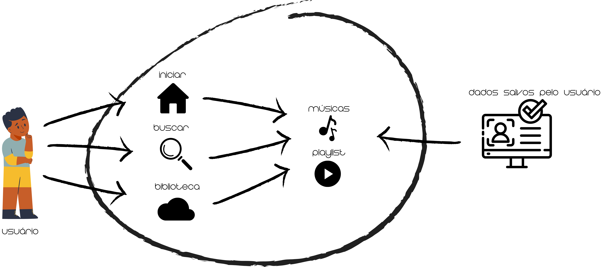

# 🎵 My_Music

**Código da Disciplina**: FGA0208 
**Número do Grupo**: 02 

##  💡 Introdução

O objetivo deste repositório é fornecer uma plataforma centralizada para o armazenamento e organização de todos os artefatos e resultados relacionados ao projeto de desenvolvimento da aplicação de reprodução de música do Grupo 2 de Arquitetura e Desenho de Software da Universidade de Brasília (UnB-FGA) no semestre 2024.1. Ele serve como um espaço colaborativo onde os membros do grupo podem compartilhar e acompanhar o progresso do trabalho, documentar decisões tomadas, armazenar código-fonte, artefatos de design, relatórios de progresso, entre outros materiais relevantes.

## 👥 Alunos

| Matrícula   | Nome                                       |                                                                                          |
|-------------|--------------------------------------------|------------------------------------------------------------------------------------------|
| 211030676   | [Ana Luíza Rodrigues da Silva](https://github.com/analuizargds) |                            |
| 190042303   | [Carlos Daniel de Godoy Barros Nascimento](https://github.com/CDGodoy) |                                |
| 190085584   | [Carlos Eduardo Mendes de Mesquita](https://github.com/CarlosEduardoMendesdeMesquita) |            |
| 180113569   | [Henrique Sandoval Camargo Hida](https://github.com/HenriqueHida) |                              |
| 190014776   | [Israel Thalles Dutra dos Santos](https://github.com/IsraelThalles) |                            |
| 200020927   | [João Vítor Motta Souto Maior](https://github.com/Jvsoutomaior) |                              |
| 200040201   | [Limíro Correia Guimarães](https://github.com/LimirioGuimaraes) |                          |
| 211062141   | [Lucas Alves Vilela](https://github.com/Lucas-AV) |                                  |
| 211063200   | [Luis Eduardo Carneiro Miranda](https://github.com/LuisMiranda10) |                            |
| 150138202   | [Luiz Guilherme Palhares Pettengill](https://github.com/luizpettengill) |                          |
| 211062339   | [Milena Baruc Rodrigues Morais](https://github.com/MilenaBaruc) |                              |
| 200026551   | [Rafael Xavier Canabrava](https://github.com/rafaelxavierr) |                            |
| 211063265   | [Vinícius Mendes Martins](https://github.com/yabamiah) |                                  |

## Sobre 
Contextualize, usando referências, links, e outros materiais como fontes.

## Screenshots Primeira Entrega <<FOCO: DSW(Base)>>

<iframe style="border: 1px solid rgba(0, 0, 0, 0.1);" width="800" height="450" src="https://www.figma.com/embed?embed_host=share&url=https%3A%2F%2Fwww.figma.com%2Fdesign%2FRgy9ZXiV9unFaOLX2vY4pF%2FProt%25C3%25B3tipo-MyMusic%3Fnode-id%3D0-1%26t%3DOd9EekrWcF3rvdEx-1" allowfullscreen></iframe>

  
Figura 1: Rich Picture. (Fonte: Milena Baruc, 2024)

## Screenshots Segunda Entrega <<FOCO: DSW(Modelagem)>>

  
Figura 2: Diagrama de Classes. (Fonte: Ana Luiza e Rafael Xavier, 2024)

  
Figura 3: Diagrama de Pacotes do Frontend com Backend. (Fonte: João Vítor, 2024)

## Screenshots Terceira Entrega <<FOCO: DSW(Padrões de Projeto)>>

  
  
Figura 4: Modelagem do padrão Factory Method (Fonte: Luis Miranda e Vinícius Mendes, 2024)

  
  
Figura 5: Modelagem do padrão Singleton (Fonte: Limírio Guimarães e Milena Baruc, 2024)

## Screenshots Quarta Entrega (FINAL) <<FOCOS: Arquitetura & Reutilização de Software & PROJETO FINAL>>
Adicione 2 ou mais screenshots em termos de artefatos da Quarta Entrega.

## Descritivo dos Principais Aspectos Técnicos 
**Principal(is) Metodologia(s) Adotada(s)**: Scrum, Kanban, XP 
**Principais Linguagens Utilizadas e/ou Pretendidas**: Dart/Flutter 
**Principais Tecnologias Utilizadas e/ou Pretendidas**: Firebase, Git, Github, VScode, Genymotion, Android Studio  
**Principal(is) Estilo(s) Arquitetural(is) Adotado(s)**:  

## Há algo a ser executado?

(x) SIM

( ) NÃO

Se SIM, insira um manual (ou um script) para auxiliar ainda mais os interessados na execução.

## Informações Complementares 
Quaisquer outras informações adicionais podem ser descritas nessa seção.
