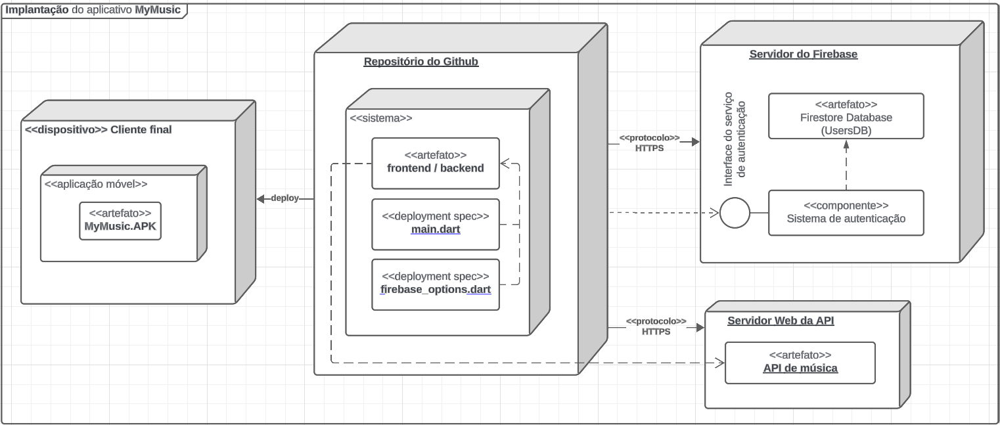

# Visão de Implantação

## Introdução

O diagrama de implantação, dentro da linguagem de modelagem unificada (UML), é uma representação gráfica que descreve a estrutura física de um sistema de software, ilustrando como seus componentes são distribuídos e interconectados em um ambiente de hardware¹. Essencialmente, ele mapeia a arquitetura física do software, mostrando a localização e a interação de seus elementos em um ambiente real.

O diagrama de implantação fornece uma visão abrangente da infraestrutura do sistema, destacando a relação entre os nós, que representam os elementos de hardware e software, e os artefatos de software, que representam os componentes do sistema. Através da visualização das conexões entre os nós, o diagrama demonstra como os dados e as informações fluem entre os diferentes componentes do sistema.

### Notações do Diagrama de Implementação

Para auxíliar a leitura do diagrama que será apresentado ao longo do artefato, aqui será demonstrado algumas notações importantes do diagrama de implantação, que foram principalmente utilizados neste artefato.

- **Nó**: O nó é uma dispositivo físico no qual o sistema é implantado, como um conjunto de servidores ou computadores;
- **Dispositivo**: É um recurso eletrônico que tem a capacidade de processar artefatos que possam ser implantados para execução;
- **Artefatos**: É qualquer componente físico de informação usado ou produzido por um sistema (schemas, .out, .exe, etc.);
- **Componente**: É uma parte modular de um sistema, no qual sua função poder ser utilizada por interfaces fornecidas;
- **Interface**: É uma especificação de comportamento ou contrato que implementadores concordam em cumprir.

## Metodologia

Antes de descrever como foi produzido o diagrama, é importante ressaltar como a equipe foi organizada para a realização deste artefato. Foi criado um subgrupo composto por duas pessoas: [Milena Baruc](https://github.com/MilenaBaruc) e [Vinícius Mendes](https://github.com/yabamiah). Todos participaram ativamente através de discussões em grupo e na realização das atividades. 

Para o desenvolvimento do diagrama, foi utilizado a plataforma Lucidchart e conversas no discord para desenvolvimento em conjunto. Além disso, foi utilizado como referência na produção deste artefato, o [diagrama de pacotes](https://unbarqdsw2024-1.github.io/2024.1_G2_My_Music/Modelagem/diagramaPacotes/) realizado pela equipe, que trouxe uma visão mais fundamentada sobre a organização do software. 

## Diagrama 

Na imagem 1 abaixo, podemos visualizar a primeira versão feita do diagrama de implementação. Neste diagrama foi representado os componentes físicos responsáveis pela implementação da aplicação móvel My Music.

Figura 1 - Primeira versão do diagrama de Implantação

Autores: [Milena Baruc](https://github.com/MilenaBaruc) e [Vinícius Mendes](https://github.com/yabamiah)

A figura abaixo ilustra uma versão atualizada do diagrama contendo um dispositivo como cliente final e um detalhamento sobre os arquivos principais que compõem a aplicação e estão no repositório do github
  
Figura 2 - Segunda versão do diagrama de implementação

Autores: [Lucas Alves Vilela](https://github.com/Lucas-AV), [Henrique Hida](https://github.com/HenriqueHida) e [Carlos Godoy](https://github.com/CDGodoy)

## Descrição de cada um dos elementos do diagrama:
- **Servidor Web da API**: Local onde a API de de músicas que fornece conteúdo ao aplicativo se encontra.

- **Servidor do Firebase**: Local onde o backend relacionado a autenticação, base de dados e controle de usuários se encontra.
    - **Firestore Database**: Base de dados de usuários no firebase
    - **Sistema de autenticação**: Controle de registro e login de usuários
  
- **Repositório do github**: Local onde todos os arquivos referentes ao código do projeto se encontram
  - **main.dart**: Arquivo de execução principal do aplicativo
  - **firebase_options.dart**: Arquivo referente a configuração base do projeto para interagir com o Firebase
  - **frontend / backend**: Demais arquivos que compõem o projeto

- **Dispositivo do cliente**: Aparelho celular do usuário
  - **MyMusic.apk**: Output de uma versão executável do projeto para o cliente final.
   
## Referências Bibliográficas

> ¹ Visual Paradigm Online. Ferramenta gratuita de diagrama de implantação on-line. Disponível em: <https://online.visual-paradigm.com/diagrams/tutorials/deployment-diagram-tutorial/>. Acesso em: 05 agosto 2024.

## Bibliografia

> Deployment Diagram. Disponível em: <https://sparxsystems.com/enterprise_architect_user_guide/16.1/modeling_languages/deploymentdiagram.html>. Acesso em: 05 agosto 2024.

> Principais visões em Arquitetura de Software. Disponível em: <https://blog.infnet.com.br/arquitetura_software/principais-visoes-em-arquitetura-de-software/>. Acesso em: 05 agosto 2024.

> Implementation, Process, and Deployment Views. Disponível em: <https://www.ece.uvic.ca/~itraore/seng422-05/notes/arch05-5.pdf>. Acesso em: 05 agosto 2024.

> Visual Paradigm Online. Ferramenta gratuita de diagrama de implantação on-line. Disponível em: <https://online.visual-paradigm.com/diagrams/tutorials/deployment-diagram-tutorial/>. Acesso em: 05 agosto 2024.

## Histórico de Versão

| Versão | Data       | Descrição       | Autores                                                                                         | Revisores |
| ------ | ---------- | --------------- | ----------------------------------------------------------------------------------------------- | --------- |
| 1.0    | 05/08/2024 | Primeira versão | [Milena Baruc](https://github.com/MilenaBaruc) e [Vinícius Mendes](https://github.com/yabamiah) | [Luis Miranda](https://github.com/LuisMiranda10), [Link da revisão](https://github.com/UnBArqDsw2024-1/2024.1_G2_My_Music/pull/81)     |
| 1.1    | 05/08/2024 | Adição da segunda versão do diagrama de implantação | [Lucas Alves Vilela](https://github.com/Lucas-AV), [Henrique Hida](https://github.com/HenriqueHida), [Carlos Godoy](https://github.com/CDGodoy) | [Luis Miranda](https://github.com/LuisMiranda10),[Link da revisão](https://github.com/UnBArqDsw2024-1/2024.1_G2_My_Music/pull/81)   |
| 1.2    | 05/08/2024 | Correção e detalhamento da segunda versão do diagrama | [Lucas Alves Vilela](https://github.com/Lucas-AV) | [Luis Miranda](https://github.com/LuisMiranda10),[Link da revisão](https://github.com/UnBArqDsw2024-1/2024.1_G2_My_Music/pull/81)   |
