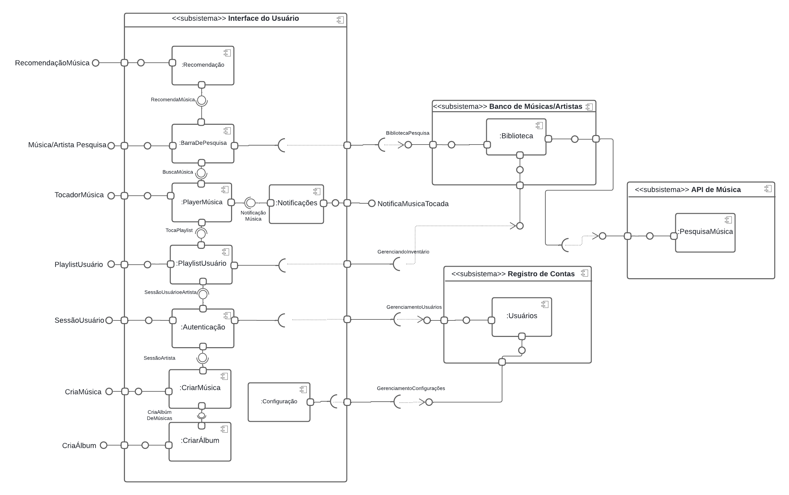

# Visão de Implementação

## Introdução
Existem várias formas de se observar um sistema, conforme descrito no site da Universidade Federal de Pernambuco, "A visão da implementação é uma das cinco visões de arquitetura de um sistema. A finalidade da visão de implementação é captar as decisões de arquitetura tomadas para a implementação."(UFPE, 2024)¹. Este documento tem como objetivo alcançar os stakeholders relacionados a implementação do sistema, nele buscamos mapear de forma lógica o código fonte e diretórios do aplicativo.

## Metodologia

Após uma reunião com toda a equipe de desenvolvimento do projeto, ficou acordado que os integrantes [Limírio Guimarães](https://github.com/LimirioGuimaraes) e [Luis Miranda](https://github.com/LuisMiranda10) seriam responsáveis por documentar a visão de implementação. Eles se reuniram e mapearam a lógica e os diretórios do código-fonte. Para contribuir com o entendimento da visão de implementação, foi confeccionado um diagrama de componentes, apresentado na Figura 1.

## Visão de Implementação

  
  
Figura 1: Modelagem da Visão de Implementação (Fonte: Limírio Guimarães e Luis Miranda, 2024)

### Componentes Principais

#### O que são os componentes no DAS (Diagrama de Arquitetura de Software)?

Os componentes do diagrama foram criados de maneira baseada no [diagrama de componentes](https://unbarqdsw2024-1.github.io/2024.1_G2_My_Music/Modelagem/diagramaComponentes/)[diagrama de classes](https://unbarqdsw2024-1.github.io/2024.1_G2_My_Music/Modelagem/diagramaClasses/). Sendo divididos em seus respectivos subsistemas, em que é visível que cada um faz uma requisição ou provê uma interface. A seguir, é descrito de maneira mais detalhada cada subsistema e seu relacionamento.

- Interface do Usuário: temos nove componentes filhos que consitutem o subsistema "Interface Usuário". Esses componentes foram projetados de acordo com a interação que os usuários vão ter dentro do aplicativo MyMusic.

- Banco de Música/Artistas: esse subsistema tem como componente filho `BIblioteca`, que é utilizada para armazenar as músicas com seus respectivos artistas que estão disponíveis no aplicativo MyMusic.

- API de Música: o componente `PesquisaMúsica` é o componente filho do subsistema "API de Música". Essa parte é responsável por desempenhar um papel crucial nas funcionalidades de busca e recuperação de músicas.

- Registro de Contas: esse subsistema tem como único componente filho `Usuários`, no qual é responsável por gerenciar todas as operações relacionadas ao registro e manutenção das informações dos usuários do sistema.

#### O que são Relacionamentos e dependências no DAS (Diagrama de Arquitetura de Software)?

Pode-se perceber que os componentes do sistema possuem relacionamentos e dependências entre eles. Com isso, segue abaixo, os principais tipos de relacionamento e dependências encontrados na nossa visão de implementação:

- Interface de Usuário - Banco de Música/Artistas:

- Interface de Usuário - Registro de Contas:

- Banco de Música/Artistas - API de Música: 

#### Frontend:
- Framework: Flutter
- Linguagem: Dart
- State Management: Provider, Riverpod ou Bloc
- UI Component Library: Flutter Widgets

#### Backend:
- Framework: Flutter
- Banco de Dados: Storage normal e o Firestore Database
- Autenticação: Firebase Authentification

A seguir podemos observar na figura 2, o diagrama de componentes referente ao código fonte do projeto, que pode ser acessado [aqui](). 

## Bibliografia

1. Esquemas de visões. Ufpr.Br. Acessado em 2 de agosto de 2024, disponível em: https://www.inf.ufpr.br/silvia/ES/projeto/aulas/aula18.pdf

## Referências Bibliográficas 
1. UFPE. (2024). Implementation View. Recuperado de https://www.cin.ufpe.br/~gta/rup-vc/core.base_rup/guidances/concepts/implementation_view_E373E3B6.html.

## Histórico de versão

| Versão | Data      | Descrição | Autores | Revisor |
| :-:    | :-----:   | :------   | ----  | ------- |
| 1.0    |02/08/2024 | Criação do Documento | [Limírio Guimarães](https://github.com/LimirioGuimaraes) e [Luis Miranda](https://github.com/LuisMiranda10)| [Fulano](hh), [Link da revisão](https://github.com/linkdapagina)  |
| 2.0    |07/08/2024 | Explicação da Construção da Visão de Implementação | [Limírio Guimarães](https://github.com/LimirioGuimaraes) e [Luis Miranda](https://github.com/LuisMiranda10)| [Fulano](hh), [Link da revisão](https://github.com/linkdapagina)  |