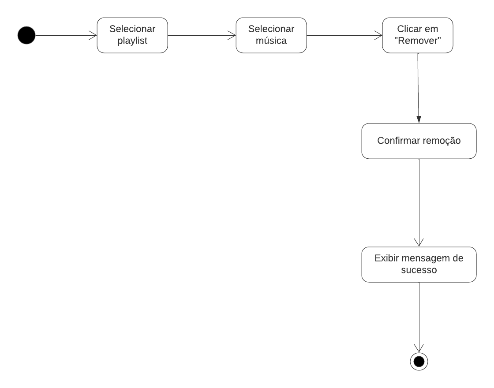
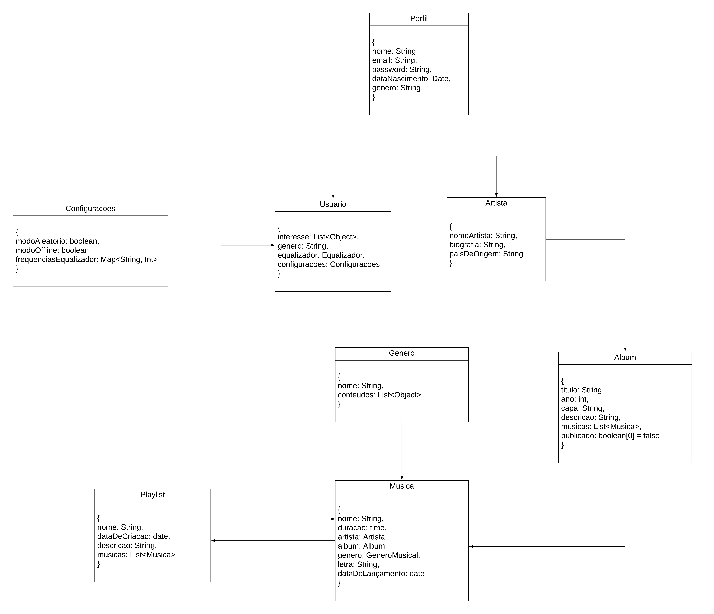

# Documento de Arquitetura de Software

# 1. Histórico de Versão

| Versão | Data       | Descrição                                                  | Autor(es)              | Revisor(es)   |
| ------ | ---------- | ---------------------------------------------------------- | ---------------------- | ------------- |
| `1.0`  | 12/08/2024 | Criação do documento e adição de todas as visões.                 | Henrique Hida           | [Luis Miranda](https://github.com/LuisMiranda10), [Link da revisão)[https://github.com/UnBArqDsw2024-1/2024.1_G2_My_Music/pull/116]       |

# 2. Introdução

Neste documento, abordamos as decisões arquiteturais tomadas pelo grupo ao longo de todas as etapas até o momento. Exploramos a visão lógica, que apresenta a divisão dos pacotes, sistemas, classes e seus relacionamentos; a visão de implementação, que se concentra nos padrões e modelos aplicados durante o desenvolvimento do projeto; a visão de implantação, que considera em quais hardwares o software seria implementado; a visão de dados, que oferece uma perspectiva sobre o armazenamento das informações no sistema; e, por fim, a visão de processos, que engloba as atividades e fluxos de trabalho relacionados ao desenvolvimento, manutenção e evolução do software ao longo de seu ciclo de vida. Caso queira analisar profundamente algum dos documentos abordados, como o visão de lógica, basta clicar em seu título.[1]

# 3. Escopo

O Documento da Arquitetura de Software se aplica ao projeto do "My Music", trabalho da disciplina de Arquitetura e Desenho de Software, que consiste em uma aplicação de streaming de música.

# 4. Definições, Acrônimos e Abreviações

| Abreviação/Acrônimo                                           | Definição                                                                                                                                                                  |
|-------------------------------------------------------------|----------------------------------------------------------------------------------------------------------------------------------------------------------------------------|
| **MVC**                                                    | Model-View-Controller: Um padrão de projeto arquitetural que separa a aplicação em três componentes principais: Modelo, Visão e Controlador.                              |
| **GRASP** - General Responsibility Assignment Software Patterns | Conjunto de padrões que oferecem diretrizes para atribuição de responsabilidades a classes e objetos em design orientado a objetos.                                      |
| **GoF** - Gang of Four                                       | Grupo de quatro autores que publicaram o livro "Design Patterns: Elements of Reusable Object-Oriented Software", contendo 23 padrões de design essenciais para o desenvolvimento de software. |
| **UML** - Unified Modeling Language                         | Linguagem de modelagem unificada utilizada para especificar, visualizar, construir e documentar artefatos de sistemas de software.                                        |
| **DAS** - Diagrama de Arquitetura de Software               | Representação visual que demonstra como os componentes de um sistema de software estão organizados e como interagem entre si.                                          |
| **DER** - Diagrama Entidade-Relacionamento                  | Diagrama utilizado para modelar a estrutura lógica de um banco de dados, mostrando as entidades e os relacionamentos entre elas.                                        |

# 5. Bibliografia

## 5.1 Bibliografria 
1. **Conceito: Visão Lógica.** Disponível em: <https://www.cin.ufpe.br/~gta/rup-vc/core.base_rup/guidances/concepts/logical_view_C135365E.html>. Acesso em: 14 ago. 2024.
2. **Documento de Arquitetura de Software.** Disponível em: <https://unbarqdsw2023-1.github.io/2023.1_G5_ProjetoRiHappy/#/4.arquiteturareutilizacao/padroes/padroesarquiteturais>. Acesso em: 13 ago. 2024.
3. **Esquemas de visões.** Ufpr.Br. Acessado em 12 de agosto de 2024. Disponível em: <https://www.inf.ufpr.br/silvia/ES/projeto/aulas/aula18.pdf>.
4. **UFPE.** (2024). Implementation View. Recuperado de <https://www.cin.ufpe.br/~gta/rup-vc/core.base_rup/guidances/concepts/implementation_view_E373E3B6.html>. Acesso em: agosto 2024.
5. **The Unified Modeling Language Org.** Activity Diagrams, 2011. Disponível em: <https://www.uml-diagrams.org/activity-diagrams.html>. Acesso em: 12 de agosto 2024.
6. **MyMusic.** 1.1.4 Protótipo, 2024. Disponível em: <https://unbarqdsw2024-1.github.io/2024.1_G2_My_Music/Base/prototipo/>. Acesso em: 11 de agosto 2024.
7. **AULA - ARQUITETURA & DAS – PARTE II.** Serrano, Milene. Disponível em: [Aprender3](https://aprender3.unb.br/). Acesso em: 11 agosto 2024.

## 5.2 Referências bibliográficas

1. **Documento de Arquitetura de Software.** Disponível em: <https://unbarqdsw2023-1.github.io/2023.1_G5_ProjetoRiHappy/#/4.arquiteturareutilizacao/padroes/padroesarquiteturais>. Acesso em: 12 ago. 2024. [1]

2. **Spotfy Web API.**. Disponível em: <https://developer.spotify.com/documentation/web-api>. Acesso em: 14 ago. 2024. [2]

# 6. [Visão Lógica](../../ArquiteturaReutilizacao/visao-de-logica.md)

## 6.1 Introdução

Dentre as representações arquiteturais que compõem o DAS, a visão de lógica é responsável por evidenciar a estrutura básica e a organização do design do sistema. Segundo a Universidade Federal de Pernambuco, essa representação "ilustra as principais realizações de caso de uso, subsistemas, pacotes e classes que abrangem o comportamento significativo em termos de arquitetura." (UFPE, 2024)¹. Para esse fim, serão abordados os diagramas de classes, de pacotes e de atividades.

## 6.2 Metodologia

Primeiramente, foi decidido que os integrantes [Carlos Eduardo](https://github.com/CarlosEduardoMendesdeMesquita), [Israel Thalles](https://github.com/IsraelThalles) e [Luiz Guilherme](https://github.com/luizpettengill) formariam um subgrupo responável pelo desenvolvimento dessa visão. Por meio de mensagens assíncronas, o grupo de participantes foi organizado de modo que o documento fosse dividido, permitindo que cada membro contribuísse com uma parte específica. À excessão do Luiz Guilherme, que não pôde participar a tempo do desenvolvimento, todos participaram ativamente na realização das atividades.

Para o desenvolvimento dessa visão arquitetural, foram utilizados o [diagrama de pacotes](https://unbarqdsw2024-1.github.io/2024.1_G2_My_Music/Modelagem/diagramaPacotes/), para uma visão mais geral da estrutura do projeto, o [diagrama de classes](https://unbarqdsw2024-1.github.io/2024.1_G2_My_Music/Modelagem/diagramaClasses/), para uma visão mais específica, e o [diagrama de atividades](https://unbarqdsw2024-1.github.io/2024.1_G2_My_Music/Modelagem/diagramaAtividades/), para demonstrar a lógica da interação do usuário com a aplicação.

## 6.3 Visão geral

O projeto está estruturado de acordo com uma adaptação do padrão arquitetural MVC com uma camada de persistência. Para que se visualize a organização da arquitetura, o diagrama de pacotes a seguir apresenta, de forma geral, a estrutura básica do projeto:

  
Figura 1: Diagrama de Pacotes Geral. (Fonte: João Vítor, 2024)

A partir da figura 1, é possível notar que o pacote Front-end desempenha o papel da camada de visão. Sua principal responsabilidade é prover uma interface para que o usuário possa interagir com o sistema. Essa camada recebe instruções do usuário, se comunica com o Back-end e apresenta os dados na interface gráfica.

A camada controladora, implementada no pacote de Back-end, age como uma intermediadora entre a camada de visão e a camada de modelo. É nessa camada que está contida toda a lógica da aplicação. Sua principal responsabilidade é receber e tratar as requisições dos usuários, eventualmente acessando dados da camada de persistência, e devolver uma resposta para a camada de visão.

Por fim, a camada do banco de dados representa a camada de modelo e é responsável por definir a estrutura dos dados e armazená-los.

## 6.4 Pacotes de design arquitetonicamente significativos

### 6.4.1 Diagrama de pacotes

  
Figura 2: Diagrama de Pacotes do Frontend com Backend. (Fonte: João Vítor, 2024)

O diagrama de pacotes, apresentado na figura 2, demonstra os principais pacotes contidos na aplicação e a relação que possuem entre si, em nosso projeto, o diagrama de pacotes evidencia os mesmos tanto na parte do Frontend quanto do Backend.

#### Pacote da camada Frontend

Aqui estão os subpacotes pertencentes ao Frontend e a relação entre eles, bem como a interação com o pacote do Backend, que serão explicados mais à frente.

##### Subpacote Src

É onde se encontra o código para as telas que serão vistas pelo usuário, nele estão contidos os Components, os Scripts e os Styles, que juntos dão a forma como as páginas serão visualizadas(Style), onde se encontram as funções que ela possuirá(Components) e onde irá procurar o código para executar a ação solicitada(Scripts), e para que isso ocorra sem erros, o subpacote Src importa as Libraries e a Api e acessa os Assets, as Libraries são onde os termos utilizados para criar o código se encontram e serão puxados de lá para que o mesmo entenda o que fazer, a Api é de onde puxa todas as funcionalidades implementadas no Backend e os Assets são onde todas as fontes de imagem se encontram.

##### Subpacote Public

É onde o que será visto pelo usuário será programado, possuindo os subpacotes Pages, que é a implementação das páginas que o aplicativo irá possuir, e Styles, que é onde estas páginas serão estilizadas, ele importa o subpacote Src e Api para que possa funcionar corretamente.

#### Pacote da camada Backend

Aqui estão os subpacotes pertencentes ao backend e a relação entre eles, e o mesmo é importado pelo pacote Frontend por meio do subpacote chamado Api.

##### Subpacote Routes

Ele é onde as rotas para que a aplicação rode se encontram, sem ele, elas estariam implementadas, mas perdidas, e assim a aplicação não funcionaria, ele importa os subpacotes utils e Services.

##### Subpacote utils

É nele que se encontra as funções que serão reutilizadas no projeto, ele também importa o subpacote Services.

##### Subpacote Services

Services é o subpacote onde o bruto das funcionalidades estão implementados, utils as tornam reutilizáveis, enquanto o Services implementa como elas funcionam, ele importa o subpacote Model.

##### Subpacote Model

Model são os modelos base utilizados para a programação geral da aplicação, sem ele, não existiria a referência para a criação dos códigos em Services.

##### Subpacote Config

Presente tanto nos pacotes de Frontend quanto Backend, embora sejam diferentes entre si, funcionam da mesma forma, garantindo que ambos os pacotes estejam implementados de acordo com o definido.

### 6.4.2 Diagrama de classes

  
Figura 3: Diagrama de classes do aplicativo My Music  (Fonte: Ana Luíza Rodrigues e Rafael Xavier, 2024)

O diagrama de classes, apresentado na figura 3, elucida como será o relacionamento das principais entidades da apicação.

#### Classe Perfil

A principal função dessa classe é definir os atibutos e o método de login que serão comuns aos dois tipos de usuário, artista e usuário comum, que a aplicação pode ter.

#### Classe Usuário

Essa é a principal classe da aplicação. Uma de suas principais renponsabilidades é reproduzir músicas ou playlists, isso engloba todos os métodos normalmente associados com reprodução de músicas, como pausar, avançar e voltar. É esse usuário o rensponsável por criar uma playlist e adicionar ou remover músicas à ela.

#### Classe Artista

A classe artista define as informações e as operações que um usuário do tipo artista pode realizar. É esse usuário o rensponsável por criar um álbum, adicionar ou remover músicas e por publicá-lo. Ele pode colaborar com uma ou mais músicas e pode ou não possuir um álbum associado a ele.

#### Classe Música

Essa classe define a estrutura de uma música. Como principais atributos, uma música possui um nome, está associada a um artista e faz parte de um álbum. Além disso, possui dois métodos que permitem aos usuários interagir com uma música pretendida, sendo eles o método reproduzir e o método pausar.

#### Classe Álbum

Um álbum, basicamente, é composto por uma ou mais músicas e está associado a um ou mais artistas. Ademais, possui métodos de manipulação de músicas.

#### Classe Playlist

É similar, em alguns aspectos, à classe Álbum, como uma lista de músicas associadas e os métodos de adição e remoção de músicas. Entretanto, playlist não necessariamente possui apenas músicas do mesmo álbum ou artista.

### 6.4.3 Diagrama de atividades

O diagrama de atividades serve para que se possa entender como as atividades que serão realizadas pelo usuário irão interagir com a aplicação, mostrando os caminhos possíveis para a ação.

  
Figura 4: Diagrama de cadastro. (Fonte: Vinícius Mendes, 2024)

O diagrama de cadastro demonstra como o mesmo é efetuado, o usuário que deseja se cadastrar precisa fornecer nome, email, senha e repetir a senha, e a aplicação irá registrar o usuário se todas as etapas tiverem sido executadas sem erros, ou retornar o que está errado.

  
Figura 5: Diagrama de login. (Fonte: Vinícius Mendes, 2024)

Para efetuar o login, a aplicação pede o nome de usuário ou o email e a senha, e confere na base de dados se eles correspondem a algum existente, efetuando o mesmo se tudo estiver correto ou retornando erro caso contrário.

  
Figura 6: Diagrama de ouvir música. (Fonte: Vinícius Mendes, 2024)

Para encontrar e reproduzir uma música, a aplicação irá possibilitar, além de pesquisar por nome, filtrar por artista, álbum, playlist e estilo musical, caso encontre, irá reproduzir a música, caso contrário, retorna que não encontrou a música pesquisada.

  
Figura 7: Diagrama de criar playlist. (Fonte: Vinícius Mendes, 2024)

Ao selecionar para criar uma playlist, o aplicativo irá criar a mesma, pedirá para que as configurações sejam implementadas e depois seguirá para a adição de músicas, onde o usuário poderá adicionar em sequência ou aos poucos, em sequência acontecerá o loop de seleção e adição, e ao concluir ou decidir por adicionar aos poucos, a playlist irá ser salva.

# 7. [Visão de Processo](../../ArquiteturaReutilizacao/visao-de-processo.md)

## 7.1 Introdução

A visão de processo corresponde a diferentes processos, suas responsabilidades, colaborações e como elas interagem entre si. É uma visão de modelo de projeto que pode ser representada utilizando objetos e mensagens trocadas, representados em classes e diagramas de interação usando a notação de processo.

Trata-se, basicamente, de uma visão do modelo de projeto, visualizada com classes e diagramas de interação, usando a notação de processo ou mesmo de thread.

Este documento tem como objetivo fornecer uma compreensão clara dos processos operacionais e interações no aplicativo de música.

## 7.2 Metodologia

Após uma reunião com toda a equipe de desenvolvimento do projeto, ficou acordado que os integrantes [Ana Luíza](https://github.com/analuizargds) e [Rafael Xavier](https://github.com/rafaelxavierr) seriam responsáveis por documentar a visão de processo. Eles se reuniram para discutir qual seria a melhor forma de trazer a perspectiva processual para o projeto. Durante a fase de modelagem, nossa equipe desenvolveu tanto o [diagrama de sequência](https://unbarqdsw2024-1.github.io/2024.1_G2_My_Music/Modelagem/diagramaSequencia/) quanto o [diagrama de atividades](https://unbarqdsw2024-1.github.io/2024.1_G2_My_Music/Modelagem/diagramaAtividades/).  

Já existiam quatro diagramas representando algumas atividades do sistema, que foram elaborados anteriormente pelo integrante [Vinícius Mendes](https://github.com/yabamiah) no documento que pode ser acessado [aqui](https://github.com/UnBArqDsw2024-1/2024.1_G2_My_Music/blob/main/docs/Modelagem/diagramaAtividades.md), e que estão estão apresentados nas figuras 1, 2, 3 e 4. Após a reunião dos integrantes responsáveis pela visão de processo, foi decidido que seriam feitos mais quatro diagramas, a fim de representar de forma mais completa as funcionalidades do sistema. Esses diagramas podem ser vistos nas figuras 5, 6, 7 e 8.

## 7.3 Visão de Processo

  
  
Figura 1: Diagrama de atividades de cadastro  (Fonte: Vinícius Mendes, 2024)

  
  
Figura 2: Diagrama de atividades de criação de playlist  (Fonte: Vinícius Mendes, 2024)

  
  
Figura 3: Diagrama de atividades de login (Fonte: Vinícius Mendes, 2024)

  
  
Figura 4: Diagrama de atividades de ouvir música (Fonte: Vinícius Mendes, 2024)

  
  
Figura 5: Diagrama de atividades de adicionar música em uma playlist (Fonte: Ana Luíza e Rafael Xavier, 2024)

  
  
Figura 6: Diagrama de atividades de remover música de uma playlist (Fonte: Ana Luíza e Rafael Xavier, 2024)

  
  
Figura 7: Diagrama de atividades de busca (Fonte: Ana Luíza e Rafael Xavier, 2024)

  
  
Figura 8: Diagrama de atividades de compartilhar (Fonte: Ana Luíza e Rafael Xavier, 2024)

# 8. [Visão de Implantação](../../ArquiteturaReutilizacao/VisaoDeImplantacao.md)

O diagrama de implantação, dentro da linguagem de modelagem unificada (UML), é uma representação gráfica que descreve a estrutura física de um sistema de software, ilustrando como seus componentes são distribuídos e interconectados em um ambiente de hardware¹. Essencialmente, ele mapeia a arquitetura física do software, mostrando a localização e a interação de seus elementos em um ambiente real.

O diagrama de implantação fornece uma visão abrangente da infraestrutura do sistema, destacando a relação entre os nós, que representam os elementos de hardware e software, e os artefatos de software, que representam os componentes do sistema. Através da visualização das conexões entre os nós, o diagrama demonstra como os dados e as informações fluem entre os diferentes componentes do sistema.

### Notações do Diagrama de Implantação

Para auxíliar a leitura do diagrama que será apresentado ao longo do artefato, aqui será demonstrado algumas notações importantes do diagrama de implantação, que foram principalmente utilizados neste artefato.

- **Nó**: O nó é uma dispositivo físico no qual o sistema é implantado, como um conjunto de servidores ou computadores;
- **Dispositivo**: É um recurso eletrônico que tem a capacidade de processar artefatos que possam ser implantados para execução;
- **Artefatos**: É qualquer componente físico de informação usado ou produzido por um sistema (schemas, .out, .exe, etc.);
- **Componente**: É uma parte modular de um sistema, no qual sua função poder ser utilizada por interfaces fornecidas;
- **Interface**: É uma especificação de comportamento ou contrato que implementadores concordam em cumprir.

## 8.1 Metodologia

Antes de descrever como foi produzido o diagrama, é importante ressaltar como a equipe foi organizada para a realização deste artefato. Foi criado um subgrupo composto por duas pessoas: [Milena Baruc](https://github.com/MilenaBaruc) e [Vinícius Mendes](https://github.com/yabamiah). Todos participaram ativamente através de discussões em grupo e na realização das atividades. 

Para o desenvolvimento do diagrama, foi utilizado a plataforma Lucidchart e conversas no discord para desenvolvimento em conjunto. Além disso, foi utilizado como referência na produção deste artefato, o [diagrama de pacotes](https://unbarqdsw2024-1.github.io/2024.1_G2_My_Music/Modelagem/diagramaPacotes/) realizado pela equipe, que trouxe uma visão mais fundamentada sobre a organização do software. 

## 8.2 Diagrama 

Na imagem 1 abaixo, podemos visualizar a primeira versão feita do diagrama de implementação. Neste diagrama foi representado os componentes físicos responsáveis pela implementação da aplicação móvel My Music.

Figura 1 - Primeira versão do diagrama de Implantação

Autores: [Milena Baruc](https://github.com/MilenaBaruc) e [Vinícius Mendes](https://github.com/yabamiah)

A figura abaixo ilustra uma versão atualizada do diagrama contendo um dispositivo como cliente final e um detalhamento sobre os arquivos principais que compõem a aplicação e estão no repositório do github

Figura 2 - Segunda versão do diagrama de implementação

Autores: [Lucas Alves Vilela](https://github.com/Lucas-AV), [Henrique Hida](https://github.com/HenriqueHida) e [Carlos Godoy](https://github.com/CDGodoy)

## 8.3 Descrição de cada um dos elementos do diagrama:
- **Servidor Web da API**: Local onde a API de de músicas que fornece conteúdo ao aplicativo se encontra.

- **Servidor do Firebase**: Local onde o backend relacionado a autenticação, base de dados e controle de usuários se encontra.
    - **Firestore Database**: Base de dados de usuários no firebase
    - **Sistema de autenticação**: Controle de registro e login de usuários

- **Repositório do github**: Local onde todos os arquivos referentes ao código do projeto se encontram
  - **main.dart**: Arquivo de execução principal do aplicativo
  - **firebase_options.dart**: Arquivo referente a configuração base do projeto para interagir com o Firebase
  - **frontend / backend**: Demais arquivos que compõem o projeto

- **Dispositivo do cliente**: Aparelho celular do usuário
  - **MyMusic.apk**: Output de uma versão executável do projeto para o cliente final.

# 9. [Visão de Implementação](../../ArquiteturaReutilizacao/VisaoDeImplementacao.md)

O Diagrama de Arquitetura de Software (DAS) é uma representação visual que demonstra como os componentes do sistema de software estão organizados e como interagem entre si. Esse diagrama de componentes inclui a perspectiva do DAS, cujo objetivo central é facilitar a visualização dos elementos que compõem o projeto.

A partir dos estudos baseados nos documentos fornecidos pela professora, percebemos que o principal objetivo do DAS é fornecer uma visão geral da arquitetura do sistema, destacando como os componentes estão conectados. Um dos maiores benefícios do DAS é a capacidade de descrever a estrutura dos subsistemas em termos de camadas e hierarquias. O DAS é útil ao evidenciar pontos de entrada e saída, fluxo de dados, interfaces e dependências entre os componentes, o que facilita a análise dos impactos de mudanças e a identificação de problemas de design ou dependências excessivas.

Em resumo, a perspectiva do DAS no My Music se baseia no diagrama de componentes, que visa principalmente facilitar a visualização dos elementos do projeto. Seu propósito é descrever as conexões e interdependências entre esses componentes, além de demonstrar a estrutura dos subsistemas em termos de camadas e hierarquias, aprimorando assim a compreensão da arquitetura global do sistema.

### 9.1 [Diagrama de Componentes](../../Modelagem/diagramaComponentes.md)

Diagrama de Componentes. (Fonte: Luis Miranda e Milena Baruc, 2024)

# 10. [Visão de Dados](../../ArquiteturaReutilizacao/visaoDados.md)

A visão de dados lida com o armazenamento, a organização e a manipulação das informações dentro do sistema. Ela descreve como os dados são estruturados, acessados e processados, garantindo a integridade, segurança e desempenho adequados. Essa visão é crucial para projetar uma arquitetura que suporte a gestão eficiente dos dados, permitindo consultas rápidas, escalabilidade e conformidade com as regulamentações vigentes.

### 10.1 Estrutura de Dados

No "My Music", utilizamos um banco de dados não relacional, adequado para a flexibilidade e escalabilidade necessárias ao lidar com dados relacionados a músicas, usuários e playlists. A diagramação dos dados é representada através de artefatos genéricos, ao invés de um DER (Diagrama de Entidade-Relacionamento), comum em bancos de dados relacionais. Isso permite maior adaptabilidade na manipulação de dados como documentos, coleções e objetos.

### 10.2 Diagrama

Na figura 1 abaixo, é apresentada a visão de dados do sistema, que ilustra como as informações são organizadas e inter-relacionadas dentro do "My Music".

Figura 1 - Visão de Dados  
  
Autores: [João Vítor](https://github.com/Jvsoutomaior)

### 10.3 Considerações de Desempenho e Escalabilidade

- **Desempenho**: A estrutura não relacional foi escolhida para garantir rapidez nas consultas e flexibilidade na gestão de grandes volumes de dados, característica essencial para um sistema de streaming de música.
- **Escalabilidade**: O banco de dados não relacional permite escalar horizontalmente o armazenamento, adequando-se ao crescimento do número de usuários e ao aumento do volume de dados, como playlists, músicas e metadados.

### 10.4 Segurança e Conformidade

A segurança dos dados é uma prioridade, sendo garantida através de mecanismos de autenticação e criptografia de dados em trânsito e em repouso. Além disso, o sistema está em conformidade com regulamentações vigentes, como a LGPD, para proteção de dados pessoais.

# 11. Visão de Integração

A Visão de Integração descreve como o sistema "My Music" se conecta com APIs externas para fornecer suas funcionalidades principais. Neste projeto, a integração com a API de música do Spotify desempenha um papel crucial ao permitir o acesso a um vasto catálogo de músicas, permitindo que os usuários busquem, reproduzam e descubram novas faixas.

### 11.1 APIs Utilizadas
API de Música do Spotify: A API do Spotify é utilizada para obter informações sobre músicas, álbuns, artistas, e para reproduzir faixas diretamente na aplicação "My Music". Essa integração permite que os usuários explorem o conteúdo disponível no Spotify através de uma interface amigável e intuitiva. [2]
- **Protocolo de Comunicação:** HTTPS
- **Formatos de Dados:** JSON
- **Principais Endpoints:**
- - **GET /v1/search**: Para buscar músicas, álbuns ou artistas.
- - **GET /v1/tracks/{id}:** Para obter detalhes sobre uma faixa específica.
- - **GET /v1/albums/{id}:** Para acessar informações sobre um álbum.
- - **GET /v1/artists/{id}:** Para recuperar detalhes de um artista.
- - **POST /v1/me/player/play:** Para reproduzir uma faixa na conta do usuário.
- **Autenticação**: OAuth 2.0, utilizando tokens de acesso para autenticar as requisições.

### 11.2 Arquitetura de Integração

- **Pontos de Entrada**: O sistema "My Music" realiza chamadas à API do Spotify principalmente através dos serviços de busca e reprodução. Esses serviços são responsáveis por interagir com a API e processar os dados retornados para exibição no aplicativo.

- **Segurança e Autenticação**: Implementamos o fluxo de autenticação OAuth 2.0 para garantir que todas as comunicações com a API do Spotify sejam seguras e autenticadas. Os tokens de acesso são gerenciados de forma segura e renovados conforme necessário para manter a continuidade do serviço.

- **Gerenciamento de Limites de Requisições**: Para evitar a superação dos limites de requisições da API do Spotify, implementamos mecanismos de caching e gerenciamento de estado, garantindo que as chamadas à API sejam otimizadas e minimizadas sempre que possível.

- **Monitoramento e Logs**: Todas as interações com a API do Spotify são monitoradas e registradas para garantir a integridade e o desempenho do sistema. Logs detalhados são mantidos para auditoria e para a rápida resolução de problemas, caso ocorram falhas nas chamadas à API.

- **Mecanismos de Recuperação de Falhas**: No caso de falhas na comunicação com a API do Spotify, o sistema está preparado para realizar tentativas de reconexão e, se necessário, notificar o usuário sobre a indisponibilidade temporária de certos serviços.

### 11.3 Desafios de Integração

A integração com a API do Spotify apresentou desafios relacionados à gestão de tokens e à adaptação das funcionalidades do Spotify à interface do My Music. No entanto, através de uma abordagem cuidadosa de design e desenvolvimento, esses desafios foram superados, resultando em uma integração robusta e eficiente.

# 12. Tamanho e desempenho

É fundamental levar em consideração as características de dimensionamento do software que afetam a arquitetura e as restrições de desempenho de destino. Observando todo o projeto, os aspectos e restrições que podemos incluir, que foram percebidos são:

- **Número de usuários**: O número de usuários que utilizarão o aplicativo de streaming de música é crucial. O software deve ser dimensionado para lidar com uma grande quantidade de usuários simultaneamente e fornecer uma resposta rápida e eficaz.
- **Volume de dados**: O aplicativo pode produzir grandes volumes de dados, como playlists, preferências de usuário, e outros metadados relacionados à música. O software deve ser projetado para lidar com o armazenamento e a recuperação desses dados de forma eficiente, garantindo uma boa performance mesmo com o aumento do volume de dados.
- **Requisitos de tempo de resposta**: Os usuários esperam uma experiência fluida e responsiva ao interagir com o aplicativo. Como resultado, devem ser estabelecidas metas claras para o tempo de resposta do sistema, garantindo que consultas e operações sejam executadas de forma rápida e eficiente.
- **Escalabilidade**: À medida que o número de usuários e o volume de dados aumentam, é necessário considerar a capacidade do sistema de escalar. Para garantir que o sistema possa lidar com o aumento das demandas, a arquitetura deve ser projetada para permitir a adição de recursos adicionais, como servidores e capacidade de armazenamento.
- **Integração com sistemas existentes**: O aplicativo pode precisar se integrar com outros sistemas ou APIs internas da empresa, além de serviços de terceiros. Como resultado, a arquitetura deve ser projetada para permitir a integração segura e eficiente com esses sistemas, além de garantir uma troca adequada de funcionalidades e dados.

Isso garantirá um sistema escalável, eficaz e seguro que atenda às necessidades dos usuários e ofereça uma experiência de usuário de alta qualidade.

# 13. Qualidade

Além da funcionalidade do sistema, a arquitetura de software ajuda a fornecer vários recursos, como extensibilidade, confiabilidade e portabilidade. Características como segurança, proteção e privacidade são essenciais para o sucesso e a qualidade do sistema. A seguir, passamos como cada um desses recursos é apoiado pela arquitetura de software:

- **Extensibilidade**: Ao fornecer uma estrutura flexível e modular, a arquitetura de software permite que o sistema seja extensível. Isso permite a adição fácil e eficiente de novos recursos, funcionalidades e componentes, sem impactar negativamente o restante do sistema.
- **Confiabilidade**: A confiabilidade do sistema depende da arquitetura de software. A arquitetura minimiza os efeitos de falhas em um componente específico, isolando e evitando que se propaguem por todo o sistema, dividindo o sistema em partes independentes e definindo suas interações e dependências.
- **Portabilidade**: A portabilidade do sistema é diretamente impactada pela arquitetura de software, pois permite que o sistema funcione em várias plataformas e ambientes. A arquitetura facilita a adaptação e a migração do sistema para vários sistemas operacionais e dispositivos, dividindo as preocupações específicas da plataforma em camadas ou componentes separados.
- **Segurança, proteção e privacidade**: A arquitetura de software é fundamental para garantir que o sistema seja seguro, protegido e privado. É possível implementar mecanismos de segurança como autenticação, controle de acesso, criptografia de dados, monitoramento e detecção de intrusões ao projetar uma arquitetura que se concentre nessas questões.
- **Desempenho**: O desempenho do sistema é diretamente afetado pela arquitetura de software. A arquitetura pode maximizar o desempenho do sistema, reduzir os gargalos e maximizar a eficiência dos processos, definindo corretamente as interações entre os componentes e administrando os recursos de forma eficaz.

Em resumo, o desenvolvimento de um sistema robusto, confiável, seguro e com bom desempenho depende da arquitetura de software. Ela fornece a base para a utilização de recursos além de seus próprios recursos, como extensão, confiabilidade, portabilidade e garantia de segurança, proteção e privacidade.
