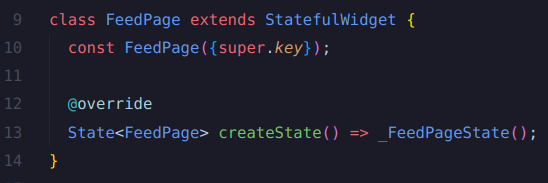
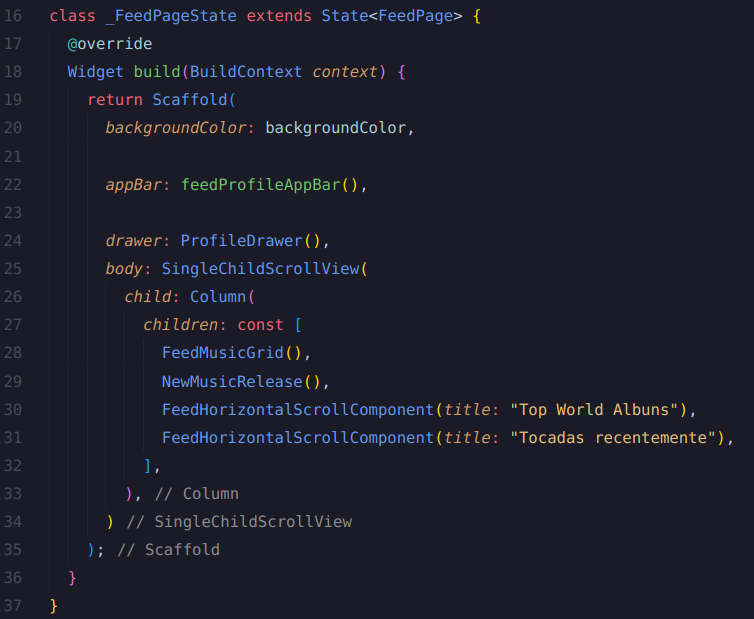

# Documento de Reutilização

## Introdução

Este artefato tem como objetivo fornecer uma visão detalhada sobre as reutilizações implementadas no software MyMusic. Nele, são abordadas reutilizações aplicáveis em diferentes níveis, incluindo o nível de projeto, onde são adotadas boas práticas e padrões de projeto amplamente estabelecidos, testados e comuns a diversos cenários. Além disso, o documento foca na reutilização em níveis de código, componentes e bibliotecas, oferecendo uma perspectiva abrangente tanto para o Front-end quanto para o Back-end.

## Metodologia

Para a elaboração deste documento, foram analisados os artefatos relacionados aos [Padrões de Projeto GoF](https://unbarqdsw2024-1.github.io/2024.1_G2_My_Music/PadroesDeProjeto/GoFsCriacionais/) implementados no projeto, assim como as documentações oficiais do Flutter e do Dart. Além disso, foi realizado um estudo aprofundado do [código implementado](https://github.com/UnBArqDsw2024-1/2024.1_G2_My_Music/tree/main/my_music_code). Com base nos conceitos aprendidos nas aulas da disciplina de Arquitetura e Desenho de Software, foi proposta uma descrição detalhada das características de reutilização aplicadas ao Front-end e Back-end, incluindo o uso de bibliotecas e frameworks.

## Reutilizações no Front-end

Para compor o front-end do projeto, utilizamos Dart e Flutter. O Dart é uma linguagem otimizada para o desenvolvimento de aplicativos rápidos em qualquer plataforma, sendo especialmente projetada para o desenvolvimento de clientes. Ele prioriza tanto a experiência de desenvolvimento, com recursos como o recarregamento rápido de estado (hot reload), quanto a produção de alta qualidade em diversas plataformas, como web, mobile e desktop. Além disso, Dart é a base do Flutter, fornecendo a linguagem e os runtimes que impulsionam os aplicativos Flutter, além de suportar tarefas essenciais de desenvolvimento, como formatação, análise e testes de código.

O Flutter é um framework de UI desenvolvido pelo Google, que oferece uma ampla gama de widgets prontos e personalizáveis para a construção de interfaces de usuário. Diferente de um "framework caixa preta", Flutter é um sistema de código aberto e transparente, permitindo aos desenvolvedores examinar, modificar e contribuir para sua implementação. Ele oferece uma estrutura clara para a criação de interfaces, possibilitando a reutilização eficiente de widgets e componentes.

No desenvolvimento de aplicativos com Flutter, a reutilização de widgets é uma prática fundamental que contribui significativamente para a eficiência e a consistência do projeto. Flutter permite a criação de widgets reutilizáveis que encapsulam funcionalidades específicas e podem ser utilizados em diferentes partes do aplicativo. Essa reutilização se manifesta de várias maneiras:

O Flutter fornece uma ampla gama de widgets básicos, como `Container`, `Row`, `Column`, `Stack`, e `ListView`, que são blocos de construção fundamentais para a criação de layouts. Esses widgets encapsulam a lógica e a apresentação necessárias para criar interfaces, permitindo que sejam reutilizados em diferentes partes do aplicativo. Além disso, widgets de interação como `ElevatedButton` e `TextButton` oferecem comportamentos comuns que podem ser aplicados em diversas seções do app, assegurando uma experiência de usuário consistente.

A Figura 1 apresenta um exemplo de reutilização da classe `FeedPage`, que estende `StatefulWidget`:

<div style="text-align: center">
  
  <p>Figura 1: Trecho de código FeedPage (Fonte: Limírio Guimarães, 2024)</p>
</div>

Nesta implementação, a classe `FeedPage` é um exemplo de como o Flutter permite a criação de widgets personalizados que encapsulam uma lógica específica e podem ser reutilizados em diferentes contextos dentro do aplicativo. Ao estender `StatefulWidget`, a `FeedPage` permite que seu estado seja gerenciado e atualizado de forma independente, promovendo a reutilização do widget com diferentes estados e comportamentos conforme necessário. Este padrão não só contribui para a modularidade do código, mas também facilita a manutenção e a escalabilidade da aplicação.

No desenvolvimento de aplicativos com Flutter, a reutilização de widgets e componentes é essencial para manter a consistência e eficiência no código. A Figura 2 ilustra um exemplo de reutilização na classe `_FeedPageState`, que estende `State<FeedPage>`:

<div style="text-align: center">
  
  <p>Figura 2: Trecho de código _FeedPageState (Fonte: Limírio Guimarães, 2024)</p>
</div>

### Explicação das Reutilizações no Trecho Apresentado

No desenvolvimento com Flutter, a reutilização de widgets é uma prática essencial para garantir a consistência, eficiência e manutenção do código. O Flutter segue um padrão bem definido para a construção de interfaces de usuário, permitindo a criação de widgets reutilizáveis que encapsulam funcionalidades específicas e podem ser utilizados em diferentes partes do aplicativo. A seguir, detalhamos a reutilização no código apresentado:

1. **`Scaffold`:**
   - O widget `Scaffold` é um dos blocos de construção fundamentais no Flutter, fornecendo uma estrutura de layout padrão para a aplicação. Ele inclui áreas predefinidas para elementos como `appBar`, `drawer`, e `body`. O uso do `Scaffold` permite que você defina a estrutura básica de uma página uma única vez e a reutilize em diferentes seções do aplicativo com personalizações específicas, facilitando a consistência e a organização do layout.

2. **`feedProfileAppBar()`:**
   - A função `feedProfileAppBar()` retorna um widget `AppBar` personalizado. Ao encapsular a criação do `AppBar` em uma função, garantimos que o mesmo estilo e comportamento possam ser aplicados em várias páginas do aplicativo. Essa prática não apenas promove a reutilização, mas também assegura uma interface de usuário uniforme, simplificando a manutenção e futuras alterações no design do `AppBar`.

3. **`ProfileDrawer`:**
   - O widget `ProfileDrawer` é utilizado como o menu lateral (`drawer`) no `Scaffold`. A reutilização desse drawer personalizado permite que a navegação entre diferentes partes do aplicativo seja consistente. Como o `ProfileDrawer` é um componente reutilizável, ele pode ser facilmente mantido e atualizado, garantindo que mudanças na navegação sejam aplicadas de forma uniforme em todas as páginas onde o drawer é utilizado.

4. **Widgets Personalizados no `body`:**
   - **`FeedMusicGrid()`**, **`NewMusicRelease()`**, e **`FeedHorizontalScrollComponent`** são exemplos de widgets personalizados que são reutilizados no corpo da página. Cada um desses widgets encapsula uma funcionalidade específica:
     - **`FeedMusicGrid`** é responsável por exibir uma grade de músicas, proporcionando uma visualização organizada do conteúdo musical.
     - **`NewMusicRelease`** apresenta novos lançamentos de música, oferecendo uma seção dedicada às novidades.
     - **`FeedHorizontalScrollComponent`** permite a exibição de listas horizontais, como álbuns populares e músicas recentemente tocadas. A reutilização desse widget com diferentes títulos exemplifica como componentes personalizados podem ser configurados para diferentes contextos e reaproveitados em várias partes da interface.

Essas práticas de reutilização não só promovem a modularidade do código, mas também facilitam a manutenção e a escalabilidade do aplicativo. Para ilustrar a reutilização no front-end, apresentamos trechos do arquivo [`feed_page.dart`](https://github.com/UnBArqDsw2024-1/2024.1_G2_My_Music/blob/main/my_music_code/lib/Feed/feed_page.dart), que é responsável pela criação da página de feed do aplicativo. Vale ressaltar que todas as outras páginas do aplicativo seguem um padrão similar de criação e reutilização de componentes, garantindo consistência e eficiência em toda a aplicação.

## Reutilizações no Back-end

Para compor o Back-end do projeto está sendo utilizado Dart e Flutter, como foi explicado anteriormente. Assim sendo, também utilizamos uma API, para que pudessemos integrar o acesso dos dados musicais do Spotify¹ no nosso App. Para que pudessemos implementar a API no projeto, foi utilizado uma [biblioteca Dart para interface com a API do Spotify](https://pub.dev/packages/spotify).

Durante a implementação da API, foram utilizadas algumas funções, fazendo o processo de reutilização durante o código.

1. **`setState`:** é uma função fundamental no Flutter usada para atualizar a interface do usuário (UI) em resposta a mudanças no estado interno de um widget. Quando você chama setState(), o Flutter sabe que algo mudou, e então ele repinta o widget com o novo estado. Exemplo:

```bash
   for (var album in newReleases.items!) {
      if (album != Null) {
        setState(() {
          musicRelease = Music(
            name: album.name!,
            id: album.id!,
            artist: album.artists!.first.name!,
            imageUrl: album.images!.first.url!,
          );
        });
      }
    }
```

2. **`final`:** é usada para declarar uma variável cujo valor não pode ser alterado depois de ser inicializado. Ou seja, uma vez que uma variável final recebe um valor, esse valor não pode ser modificado durante a execução do programa. Exemplo:

```bash
class Music {
  final String? name;
  final String? id;
  final String? artist;
  final String? imageUrl;

  Music({this.name, this.id, this.artist, this.imageUrl});
}
```

## Hots-pots e Frozen-spots

### Hot-spots

No contexto do desenvolvimento de software e especialmente em sistemas de alto desempenho, hot-spots referem-se às áreas do código ou do sistema que experimentam uma carga significativa de processamento ou acesso. Identificar esses pontos críticos é fundamental para otimizar o desempenho e a eficiência do sistema. No projeto MyMusic, alguns exemplos de hot-spots podem incluir:

1. *Pontos de Acesso a Dados:* As funções que fazem chamadas frequentes para a API do Spotify são exemplos de hot-spots. Essas funções devem ser otimizadas para garantir que o acesso à API não se torne um gargalo. O uso de técnicas como cache e otimização das chamadas API pode melhorar a performance.

2. *Componentes de UI Dinâmicos:* Widgets que realizam cálculos pesados ou atualizações frequentes, como as listas de músicas e os feeds de lançamentos, podem se tornar hot-spots. Esses componentes precisam ser projetados para minimizar a quantidade de trabalho realizado durante a construção e atualização da interface.

3. *Funções de Processamento:* Funções que processam grandes volumes de dados, como a manipulação e análise de listas de músicas, são áreas críticas que devem ser otimizadas para evitar lentidão no sistema.

### Frozen-spots

Frozen-spots referem-se às áreas do código ou do sistema que são estáveis e raramente alteradas. Essas áreas, embora menos críticas para a performance imediata, são importantes para a manutenção e confiabilidade do sistema. No projeto MyMusic, exemplos de frozen-spots incluem:

1. *Definições de Dados Estáticas:* Classes e estruturas de dados que são invariáveis ao longo do tempo, como a definição da classe Music, são exemplos de frozen-spots. Essas estruturas são essenciais para a representação de dados e devem ser projetadas para serem robustas e imutáveis.

2. *Configurações de Frameworks:* Configurações e definições de bibliotecas de terceiros, como o uso do Flutter e do Dart, são áreas estáveis que não mudam frequentemente. Garantir a estabilidade dessas configurações é crucial para a integridade e continuidade do projeto.

3. *Componentes de Interface Consistentes:* Widgets e componentes que fornecem uma aparência e comportamento consistentes em todo o aplicativo, como o ProfileDrawer, são frozen-spots. Essas partes do código raramente mudam, e sua estabilidade ajuda a manter a consistência da interface do usuário.

## Conclusão

O projeto MyMusic exemplifica a importância da reutilização eficaz tanto no Front-end quanto no Back-end para criar uma aplicação escalável e eficiente. A utilização de Dart e Flutter para o desenvolvimento Front-end permite a criação de widgets reutilizáveis, promovendo a consistência e facilitando a manutenção. No Back-end, a integração com a API do Spotify e o uso de práticas como setState e final asseguram que o sistema se mantenha eficiente e bem estruturado.

A identificação de hot-spots e frozen-spots é crucial para a otimização e estabilidade do sistema. Hot-spots, como pontos de acesso a dados e componentes de UI dinâmicos, precisam ser cuidadosamente monitorados e otimizados. Por outro lado, frozen-spots, como definições de dados estáticos e configurações de frameworks, devem ser mantidos estáveis para garantir a continuidade e integridade do projeto.

A combinação dessas práticas de reutilização e otimização resulta em um sistema robusto e eficiente, capaz de atender às necessidades dos usuários e adaptar-se a novas demandas com facilidade.

## Referência Bibliografica

> ¹ Spotify. Spotify. Disponível em: <https://www.spotify.com>. Acesso em: 14 ago. 2024.

## Bibliografia

> SERRANO, Milene. Arquitetura e Desenho de Software - Aula REUTILIZAÇÃO & FRAMEWORK 1º/2022. Material apresentado para a disciplina de Arquitetura e Desenho de Software no curso de Engenharia de Software da UnB, FGA.
> Dart overview. Dart.dev. Acessado em 12 de agosto de 2024. Disponível em: <https://dart.dev/overview>
> ANDREY, Fábio; DE CASTRO, Andrey. Padrões e Frameworks de Arquitetura de Software. 2024. Disponível em: <https://www.inf.ufpr.br/andrey/ci163/PadroesFrameworksAl.pdf.> Acesso em: 14 ago. 2024.

## Histórico de versão

| Versão | Data      | Descrição | Autores | Revisor |
| :-:    | :-----:   | :------   | ----  | ------- |
| 1.0    |12/08/2024 | Criação do Documento | [Limírio Guimarães](https://github.com/LimirioGuimaraes) e [Milena Baruc](https://github.com/MilenaBaruc)| [Ana Luiza](https://github.com/analuizargds), [Link da revisão](https://github.com/UnBArqDsw2024-1/2024.1_G2_My_Music/pull/114#pullrequestreview-2238788424) |
| 2.0    |14/08/2024 | Correções do Documento | [Milena Baruc](https://github.com/MilenaBaruc)| |

