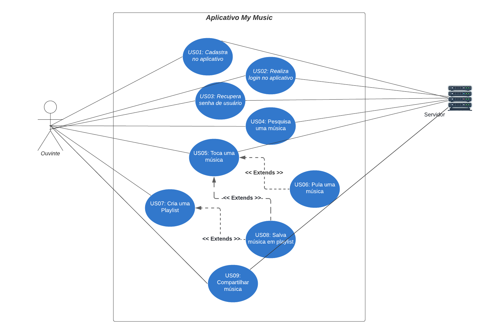

## Visão de Casos de Uso

## Introdução

Os casos de uso descrevem como os diferentes usuários interagem com o nosso sistema, detalhando os principais cenários de uso e as funcionalidades do sistema. Ela define os atores envolvidos, seus objetivos e como o sistema responde a esses objetivos, fornecendo uma compreensão clara dos requisitos funcionais do sistema. Através da modelagem de casos de uso, identificamos e documentamos os processos essenciais que o sistema deve suportar, garantindo que todas as necessidades dos usuários sejam atendidas de maneira eficiente e eficaz.

## Metodologia

Após uma reunião com todos os membros da equipe, decidiu-se pela documentação da visão de casos de uso, com Carlos Eduardo Mendes de Mesquita e Carlos Godoy liderando essa iniciativa. A metodologia adotada envolveu a realização de simulações práticas do uso do aplicativo, cujos cenários foram discutidos em reuniões via Google Meet. Esses casos de uso foram documentados em diagramas detalhados utilizando a ferramenta ¹Lucidchart, com base em exemplos práticos fornecidos pelo site, assegurando a inclusão de todos os cenários relevantes para o sistema.

## Casos de uso

Em um diagrama de casos de uso, os atores são representados como bonecos palitos e os casos de uso que podem ser executados são representados em formato oval na direção horizontal, como mostrado na figura 1, que é o diagrama de casos de uso elaborado para essa entrega. 

### Levantamento dos casos de uso

No levantamento de casos de uso, além das reuniões mencionadas anteriormente, utilizamos os documentos de levantamento de requisitos como base para a realização das simulações práticas do uso do aplicativo. Esses documentos ([Requisitos levantados por Brainstorm](https://unbarqdsw2024-1.github.io/2024.1_G2_My_Music/Base/brainstorming/#resultados), [Requisitos elicitados por entrevista](https://unbarqdsw2024-1.github.io/2024.1_G2_My_Music/Base/entrevista/#requisitos-elicitados) e [Definição do perfil de usuário](https://unbarqdsw2024-1.github.io/2024.1_G2_My_Music/Base/questionario/#definicao-do-perfil-de-usuario)) forneceram informações cruciais para identificar os principais cenários de interação do usuário com o sistema. A partir dessas simulações, discutimos e refinamos os casos de uso, assegurando que todos os requisitos fossem contemplados de forma abrangente. 

#### Tabela de Casos de Uso

##### Atores

| Número | Ator | Descrição|
| --- | --- | --- |
| 1 | Ouvinte | Usuário ouvite de músicas no My Music |
| 2 | Servidor | Servidor do My Music |

Fonte: Carlos Nacimento e Carlos Mesquita

A aplicação foi definida como possuindo apenas dois atores que interagem como a mesma, o usuário, registrado como ouvinte, e o aplicativo, registrado como servidor. 

##### Casos de uso

| Código | Descrição |
| --- | --- |
| US01 | Cadastra no aplicativo |
| US02 | Realiza Login no aplicativo |
| US03 | Recupera senha de usuário |
| US04 | Pesquisa uma música |
| US05 | Toca uma música |
| US06 | Pula uma música |
| US07 | Cria uma playlist |
| US08 | Salvar música em Playlist |
| US09 | Compartilhar música |

Fonte: Carlos Nacimento e Carlos Mesquita

A tabela acima representa os casos de uso implementados no diagrama, decididos como os mais importantes de serem documentados por abrangerem completamente o uso do aplicativo pelo usuário, que no momento se resume ao ouvinte, o diagrama pode ser encontrado na figura 1 abaixo. 
Como explicado na referência utilizada para a criação dos casos de uso, em boa parte das documentações em que é utilizado, os casos de uso também são descritos e forma textual, o que será feito nesta parte do documento.

"US" é apenas uma unidade definida por nós para enumerar os casos de uso.

### US01 - Cadastra no aplicativo

Esse caso de uso se refere ao primeiro uso da aplicação pelos atores, é nele em que o login será criado e salvo para futuras utilizações do aplicativo.

### US02 - Realiza Login no aplicativo

É um caso de uso análogo ao US01, mas entra em vigor logo após a execução do mesmo, se tornando o uso mais comum do aplicativo, pois sem logar, o usuário não terá acesso às músicas salvas por ele.

### US03 - Recupera senha de usuário

É um caso de uso mais nichado, porém com grande utilidade em qualquer aplicação, permitindo que o usuário recupere o acesso a sua conta.

### US04 - Pesquisa uma música

É por meio deste US que os usuários podem encontrar e salvar músicas para escutar, juntar em playlists e compartilhar com outros usuários e não usuários.

### US05 - Toca uma música

É acionado quando o usuário decide reproduzir uma música salva ou não pelo aplicativo.

### US06 - Pula uma música 

É aplicado quando o usuário opta por pular uma música recomendada ou de alguma playlist compartilhada ou criada pelo mesmo.

### US07 - Cria uma playlist

Acionado quando uma playlist é criada por um usuário.

### US08 - Salvar música em playlist

Acionado quando se opta por salvar uma música em alguma playlist, seja a principal ou nova.

### US09 - Compartilhar música

Acionado quando o usuário quer compartilhar uma música do aplicativo com outro usuário ou não usuário.

##### Diagrama de casos de uso

Figura 1: Diagrama de casos de uso(Fonte: Carlos Nascimento e Carlos Mesquita,2024)

## Referências Bibliográficas
> ¹Lucidchart. Ferramenta de criação de diagramas online. Disponível em: <https://lucid.app/>

## Bibliografia
> ²Dev Media. Disponível em: <https://www.devmedia.com.br/o-que-e-uml-e-diagramas-de-caso-de-uso-introducao-pratica-a-uml/23408>. Acesso em: 07 de agosto de 2024.  
> ³Tribunal Regional do Trabalho da 9° Região. Disponível em: <https://www.trt9.jus.br/pds/pdstrt9/guidances/concepts/use_case_model_CD178AF9.html#:~:text=Um%20modelo%20de%20caso%20de,sistema%20para%20satisfazer%20estas%20metas.>. Acesso em 14 de agosto de 2024

## Histórico de Versões

|    Versão    |    Data    | Descrição | Autor(es) | Revisor(es) |
| ------------ | ---------- | --------- | --------- | ----------- |
| 1.0          | 07/08/2024 | Criação da página | [Carlos Eduardo Mendes de Mesquita](https://github.com/CarlosEduardoMendesdeMesquita) e [Carlos Godoy](https://github.com/CDGodoy) | [Limírio Guimarães](https://github.com/LimirioGuimaraes) [Link da revisão](https://github.com/UnBArqDsw2024-1/2024.1_G2_My_Music/pull/118#pullrequestreview-2239411706) |
| 1.1          | 14/08/2024 | Conclusão do mkdocs da entrega(escrito via google docs) | [Carlos Eduardo Mendes de Mesquita](https://github.com/CarlosEduardoMendesdeMesquita) e [Carlos Godoy](https://github.com/CDGodoy) | [Limírio Guimarães](https://github.com/LimirioGuimaraes)  [Link da revisão](https://github.com/UnBArqDsw2024-1/2024.1_G2_My_Music/pull/118#pullrequestreview-2239411706)  |
| 1.2          | 14/08/2024 | Melhorias pós revisão | [Carlos Eduardo Mendes de Mesquita](https://github.com/CarlosEduardoMendesdeMesquita) e [Carlos Godoy](https://github.com/CDGodoy) |   |
