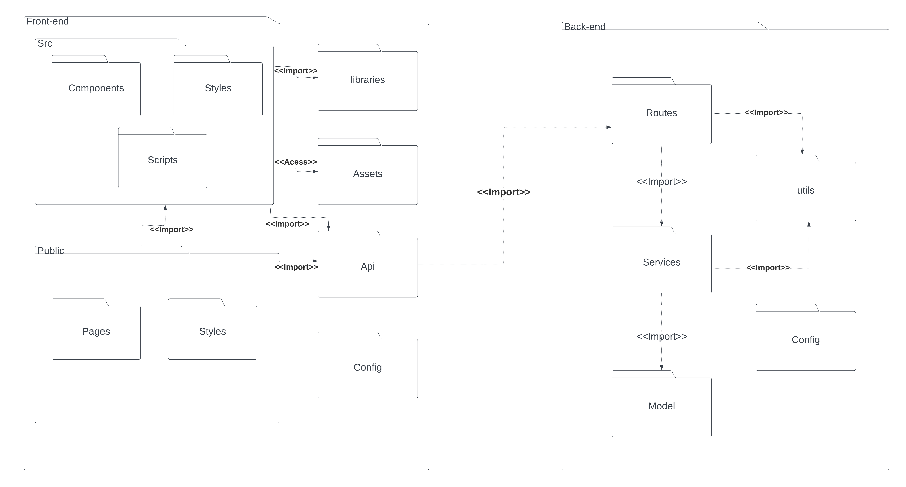
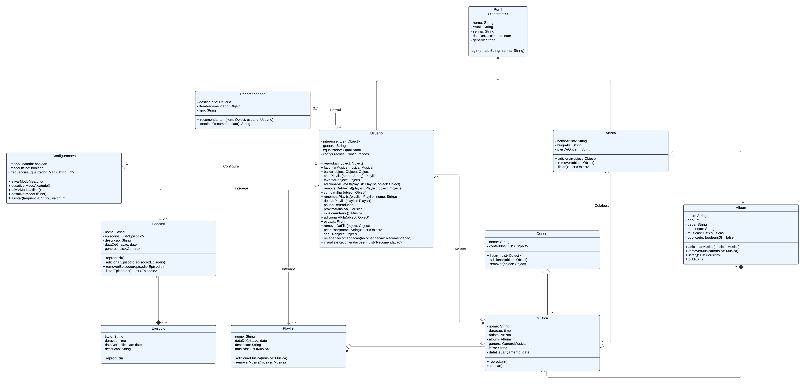
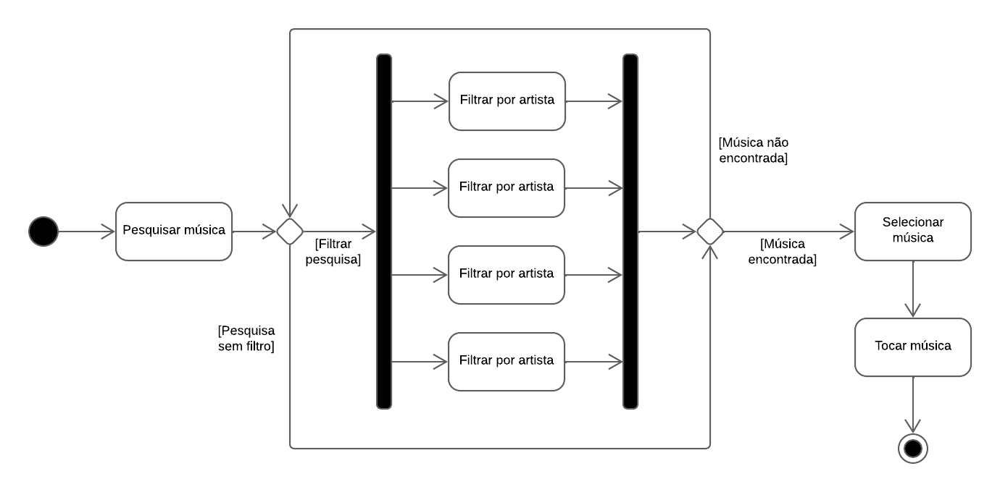
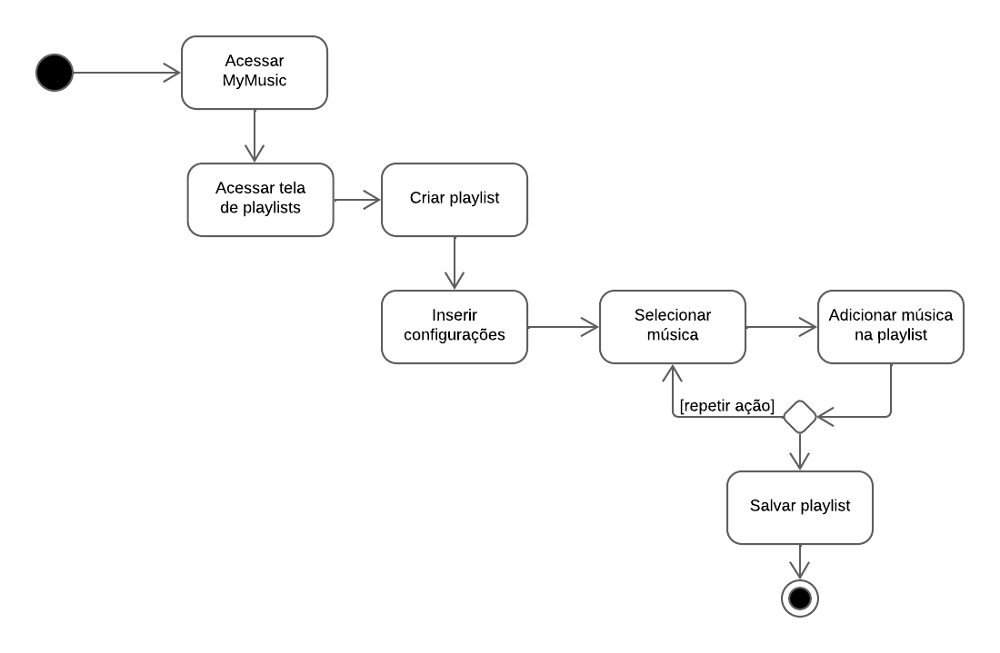

# Visão Lógica

Dentre as representações arquiteturais que compõem o DAS, a visão de lógica é responsável por evidenciar a estrutura básica e a organização do design do sistema. Segundo a Universidade Federal de Pernambuco, essa representação "ilustra as principais realizações de caso de uso, subsistemas, pacotes e classes que abrangem o comportamento significativo em termos de arquitetura." (UFPE, 2024)¹. Para esse fim, serão abordados os diagramas de classes, de pacotes e de atividades.

## Visão geral

O projeto está estruturado de acordo com uma adaptação do padrão arquitetural MVC com uma camada de persistência. Para que se visualize a organização da arquitetura, o diagrama de pacotes a seguir apresenta, de forma geral, a estrutura básica do projeto:

  
Figura 1: Diagrama de Pacotes Geral. (Fonte: João Vítor, 2024)

A partir da figura 1, é possível notar que o pacote Front-end desempenha o papel da camada de visão. Sua principal responsabilidade é prover uma interface para que o usuário possa interagir com o sistema. Essa camada recebe instruções do usuário, se comunica com o Back-end e apresenta os dados na interface gráfica.

A camada controladora, implementada no pacote de Back-end, age como uma intermediadora entre a camada de visão e a camada de modelo. É nessa camada que está contida toda a lógica da aplicação. Sua principal responsabilidade é receber e tratar as requisições dos usuários, eventualmente acessando dados da camada de persistência, e devolver uma resposta para a camada de visão.

Por fim, a camada do banco de dados representa a camada de modelo e é responsável por definir a estrutura dos dados e armazená-los.

## Pacotes de design arquitetonicamente significativos

(Para cada pacote significativo, inclua uma subseção com seu nome, sua breve descrição e um diagrama com todas as classes e pacotes significativos contidos no pacote.
Para cada classe significativa no pacote, inclua seu nome, breve descrição e, opcionalmente, uma descrição de algumas de suas principais responsabilidades, operações e atributos.)

### Diagrama de pacotes

  
Figura 2: Diagrama de Pacotes do Frontend com Backend. (Fonte: João Vítor, 2024)

### Diagrama de classes

  
Figura 3: Diagrama de classes do aplicativo My Music  (Fonte: Ana Luíza Rodrigues e Rafael Xavier, 2024)

O diagrama de classes, apresentado na figura 3, elucida como será o relacionamento das principais entidades da apicação.

#### Classe Perfil

A principal função dessa classe é definir os atibutos e o método de login que serão comuns aos dois tipos de usuário, artista e usuário comum, que a aplicação pode ter.

#### Classe Usuário

Essa é a principal classe da aplicação. Uma de suas principais renponsabilidades é reproduzir músicas ou playlists, isso engloba todos os métodos normalmente associados com reprodução de músicas, como pausar, avançar e voltar. É esse usuário o rensponsável por criar uma playlist e adicionar ou remover músicas à ela.

#### Classe Artista

A classe artista define as informações e as operações que um usuário do tipo artista pode realizar. É esse usuário o rensponsável por criar um álbum, adicionar ou remover músicas e por publicá-lo. Ele pode colaborar com uma ou mais músicas e pode ou não possuir um álbum associado a ele.

#### Classe Música

Essa classe define a estrutura de uma música. Como principais atributos, uma música possui um nome, está associada a um artista e faz parte de um álbum. Além disso, possui dois métodos que permitem aos usuários interagir com uma música pretendida, sendo eles o método reproduzir e o método pausar.

#### Classe Álbum

Um álbum, basicamente, é composto por uma ou mais músicas e está associado a um ou mais artistas. Ademais, possui métodos de manipulação de músicas.

#### Classe Playlist

É similar, em alguns aspectos, à classe Álbum, como uma lista de músicas associadas e os métodos de adição e remoção de músicas. Entretanto, playlist não necessariamente possui apenas músicas do mesmo álbum ou artista.

### Diagrama de atividades

  
Figura 4: Diagrama de cadastro. (Fonte: Vinícius Mendes, 2024)

  
Figura 5: Diagrama de login. (Fonte: Vinícius Mendes, 2024)

  
Figura 6: Diagrama de ouvir música. (Fonte: Vinícius Mendes, 2024)

  
Figura 7: Diagrama de criar playlist. (Fonte: Vinícius Mendes, 2024)

## Bibliografia
> Conceito: Visão Lógica. Disponível em: <https://www.cin.ufpe.br/~gta/rup-vc/core.base_rup/guidances/concepts/logical_view_C135365E.html>. Acesso em: 4 ago. 2024.

> Documento de Arquitetura de Software. Disponível em: <https://unbarqdsw2023-1.github.io/2023.1_G5_ProjetoRiHappy/#/4.arquiteturareutilizacao/padroes/padroesarquiteturais>. Acesso em: 4 ago. 2024.

## Referências Bibliográficas 
>¹ Conceito: Visão Lógica. Disponível em: <https://www.cin.ufpe.br/~gta/rup-vc/core.base_rup/guidances/concepts/logical_view_C135365E.html>. Acesso em: 4 ago. 2024.

## Histórico de versão

| Versão | Data       | Descrição | Autores | Revisor |
| ------ | ---------- | --------- | ------- | ------- |
| 1.0    | 03/08/2024 | Criação do Documento | [Israel Thalles](https://github.com/IsraelThalles) |   |
| 1.1    | 04/08/2024 | Adição de introdução e referências | [Israel Thalles](https://github.com/IsraelThalles) |   |
| 1.2    | 05/08/2024 | Alteração no template | [Israel Thalles](https://github.com/IsraelThalles) |   |
| 1.3    | 06/08/2024 | Adição da visão geral | [Israel Thalles](https://github.com/IsraelThalles) |   |
| 1.4    | 09/08/2024 | Adição da explicação do diagrama de classes | [Israel Thalles](https://github.com/IsraelThalles) |   |