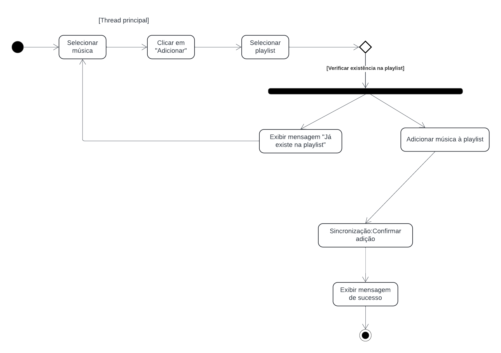
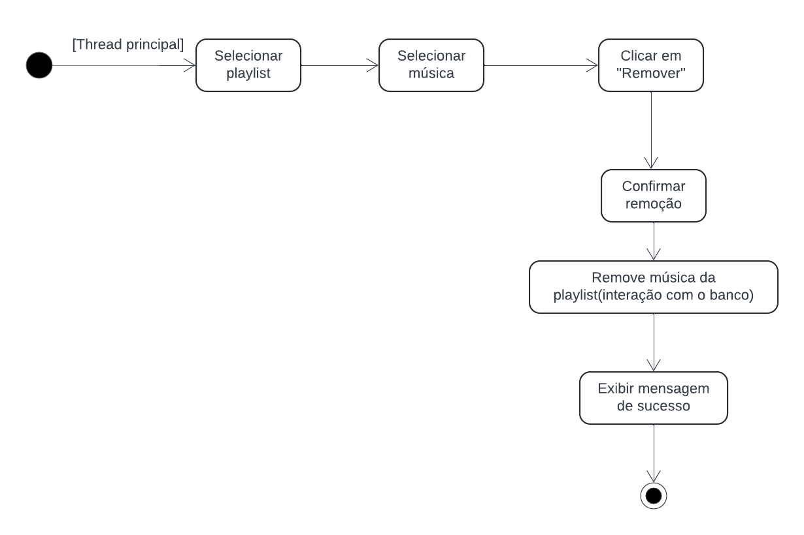
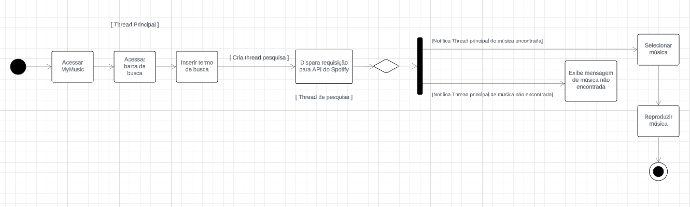
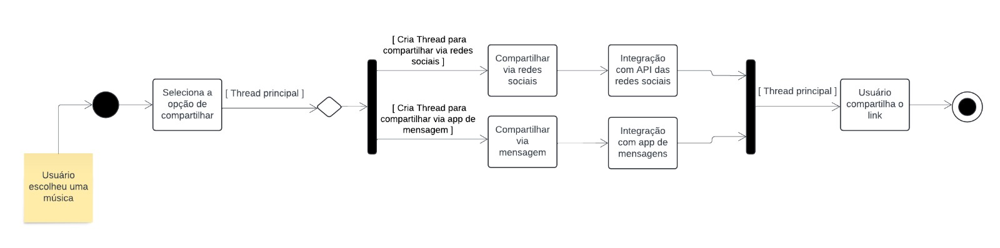

# Visão de Processo

## Introdução

A visão de processo corresponde a diferentes processos, suas responsabilidades, colaborações e como elas interagem entre si. É uma visão de modelo de projeto que pode ser representada utilizando objetos e mensagens trocadas, representados em classes e diagramas de interação usando a notação de processo.

Trata-se, basicamente, de uma visão do modelo de projeto, visualizada com classes e diagramas de interação, usando a notação de processo ou mesmo de thread.[1]

Este documento tem como objetivo fornecer uma compreensão clara dos processos operacionais e interações no aplicativo de música.

## Metodologia

Após uma reunião com toda a equipe de desenvolvimento do projeto, ficou acordado que os integrantes [Ana Luíza](https://github.com/analuizargds) e [Rafael Xavier](https://github.com/rafaelxavierr) seriam responsáveis por documentar a visão de processo. Eles se reuniram para discutir qual seria a melhor forma de trazer a perspectiva processual para o projeto. Durante a fase de modelagem, nossa equipe desenvolveu tanto o [diagrama de sequência](https://unbarqdsw2024-1.github.io/2024.1_G2_My_Music/Modelagem/diagramaSequencia/) quanto o [diagrama de atividades](https://unbarqdsw2024-1.github.io/2024.1_G2_My_Music/Modelagem/diagramaAtividades/).  

Após a reunião dos integrantes responsáveis pela visão de processo, foi decidido que seriam feitos mais quatro diagramas de atividade, mas dessa vez saindo da camada lógica e seguindo para a camada de processo efetivamente, a fim de representar de forma mais completa as funcionalidades do sistema. Esses diagramas podem ser vistos nas figuras 1, 2, 3 e 4.

## Visão de Processo

  
  
Figura 1: Diagrama de atividades de adicionar música em uma playlist (Fonte: Ana Luíza e Rafael Xavier, 2024)

**Thread Principal:**
  - O usuário inicia o processo selecionando uma música e clicando em "Adicionar".
  - A Thread Principal gerencia essas ações iniciais e chama a verificação de existência da música na playlist.

  - **Verificação de Existência:**
    - A Thread Principal pode criar uma sub-thread ou realizar uma verificação em segundo plano para consultar a API ou banco de dados e determinar se a música já existe na playlist.

  - **Decisão: Música Existe na Playlist?**
    - **Música Já Existe:** A interface exibe uma mensagem informando que a música já está na playlist.
    - **Música Não Existe:** A música é adicionada à playlist.

  - **Adicionar Música à Playlist:** A música é inserida na playlist através de uma interação com o banco de dados ou API do serviço de música.

  - **Confirmação e Sucesso:** A Thread Principal confirma a adição da música e exibe uma mensagem de sucesso ao usuário.

  
  
Figura 2: Diagrama de atividades de remover música de uma playlist (Fonte: Ana Luíza e Rafael Xavier, 2024)

**Thread Principal:**
  - O usuário seleciona a playlist e a música que deseja remover.
  - A Thread Principal gerencia essas ações iniciais e segue para a confirmação da remoção.

  - **Confirmação da Remoção:**
    - A Thread Principal pede a confirmação do usuário para remover a música da playlist.
    - Uma sub-thread pode ser criada para realizar a remoção no banco de dados ou na API correspondente.

  - **Remoção da Música:**
    - A música é removida da playlist.
    - O sistema interage com o banco de dados ou API para realizar essa remoção.

  - **Confirmação e Sucesso:**
    - A Thread Principal confirma a remoção da música e exibe uma mensagem de sucesso ao usuário.

  
  
Figura 3: Diagrama de atividades de busca (Fonte: Ana Luíza e Rafael Xavier, 2024)

**Thread Principal:**

- **Início da pesquisa:** O usuário insere o termo de busca e a Thread Principal cria a Thread de Pesquisa para realizar a busca utilizando a API do Spotify.

**Thread De Pesquisa:**

- **Consulta à API do Spotify:** A Thread de Pesquisa dispara uma requisição à API do Spotify utilizando o termo de busca fornecido.

- **Aguardar Resposta da API:** A Thread de Pesquisa aguarda a resposta, que pode ser:
  - Sucesso: A música é encontrada
  - Falha: Nenhuma música é encontrada que corresponda ao termo de busca.

- **Processamento do Resultado:** 
  - Se a música é encontrada, a Thread de Pesquisa notifica a Thread Principal, que então continua o fluxo para selecionar e reproduzir a música.
  - Se a música não é encontrada, a Thread de Pesquisa notifica a Thread Principal para exibir a mensagem de que a música não foi encontrada.

**Retorno do Controle à Thread Principal:** 

- Após a notificação, a Thread Principal retoma o controle para executar as ações subsequentes (seleção e reprodução ou exibição de mensagem).

  
  
Figura 4: Diagrama de atividades de compartilhar (Fonte: Ana Luíza e Rafael Xavier, 2024)

O usuário escolhe uma música, iniciando o fluxo de compartilhamento.

**Thread Principal:** É responsável por gerenciar as ações do usuário, como selecionar a opção de compartilhar e definir o método de compartilhamento (redes sociais ou mensagem).
- **Decisão do Método de Compartilhamento:**

  - O usuário escolhe entre compartilhar via redes sociais ou via mensagem.
Dependendo da escolha, o fluxo segue para a criação de threads específicas para cada tipo de compartilhamento.

**Thread de Compartilhamento:**

- **Compartilhamento via Redes Sociais:** Uma thread é criada para gerenciar a integração com APIs de redes sociais (como Facebook, Twitter, etc.), enviando o link da música.

- **Compartilhamento via Mensagem:** Outra thread é criada para enviar o link via um aplicativo de mensagens (como WhatsApp, SMS, etc.).

**Sincronização e Finalização:** Após o compartilhamento, ambas as threads convergem de volta para a Thread Principal, que conclui o processo. O usuário recebe uma confirmação de que o link foi compartilhado com sucesso.

## Bibliografia

> The Unified Modeling Languag Org. Activity Diagrams, 2011. Disponível em: https://www.uml-diagrams.org/activity-diagrams.html. Acesso em: 12 de Abril.

> MyMusic. 1.1.4 Protótipo, 2024. Disponível em: https://unbarqdsw2024-1.github.io/2024.1_G2_My_Music/Base/prototipo/. Acesso em: 7 de Julho.

## Referências Bibliográficas 

> [1] AULA - ARQUITETURA & DAS – PARTE II. Serrano, Milene. Disponível em: [Aprender3](https://aprender3.unb.br/). Acesso em: 06 agosto 2024.

## Histórico de versão

| Versão | Data      | Descrição | Autores | Revisor |
| :-:    | :-----:   | :------   | ----  | ------- |
| 1.0    |06/08/2024 | Criação do Documento | [Ana Luíza](https://github.com/analuizargds) e [Rafael Xavier](https://github.com/rafaelxavierr) | [Vinícius Mendes](https://github.com/yabamiah) , [Link da revisão](https://github.com/UnBArqDsw2024-1/2024.1_G2_My_Music/pull/85)  [Carlos Eduardo Mendes de Mesquita](https://github.com/CarlosEduardoMendesdeMesquita), [Link da revisão](https://github.com/UnBArqDsw2024-1/2024.1_G2_My_Music/pull/85) |
| 1.1    |15/08/2024 | Correção dos diagramas | [Ana Luíza](https://github.com/analuizargds) e [Rafael Xavier](https://github.com/rafaelxavierr) | [Israel Thalles](https://github.com/IsraelThalles) ([Link da revisão](https://github.com/UnBArqDsw2024-1/2024.1_G2_My_Music/pull/124#pullrequestreview-2241497107)) |
