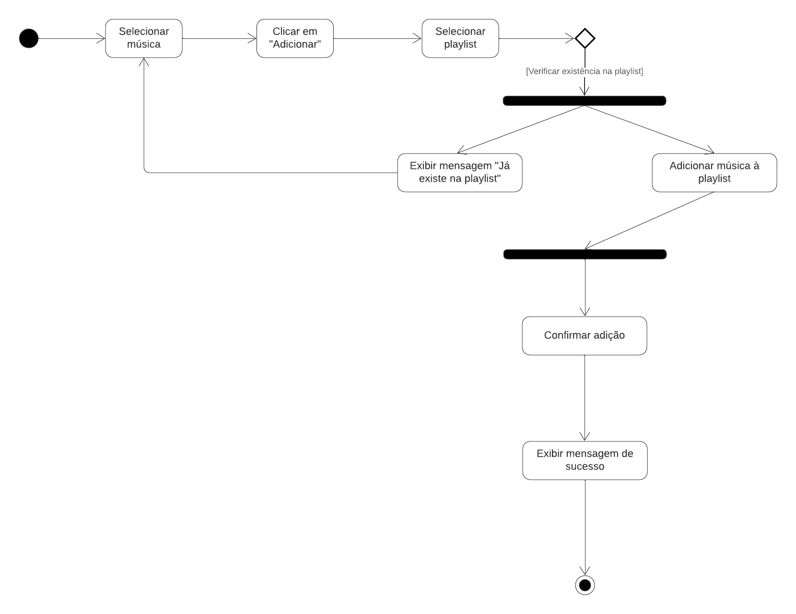
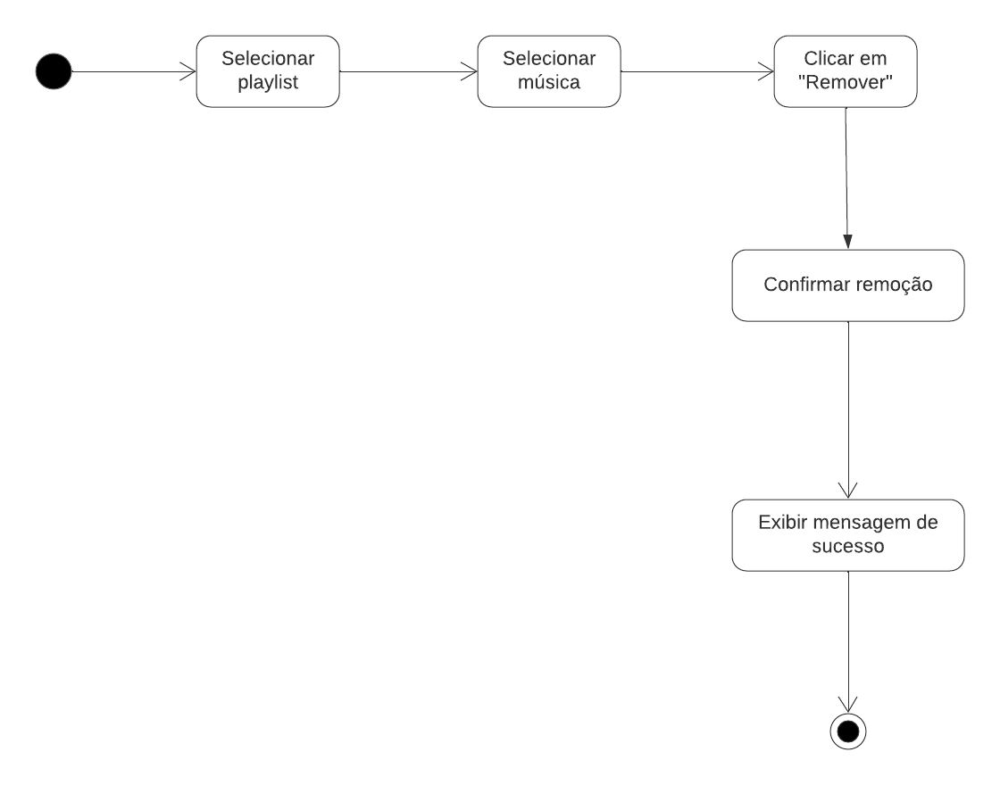
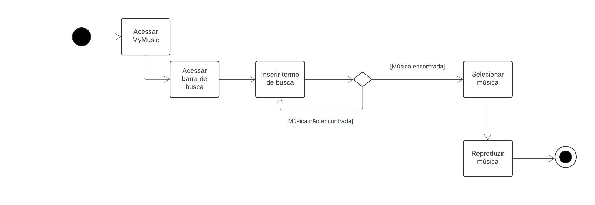
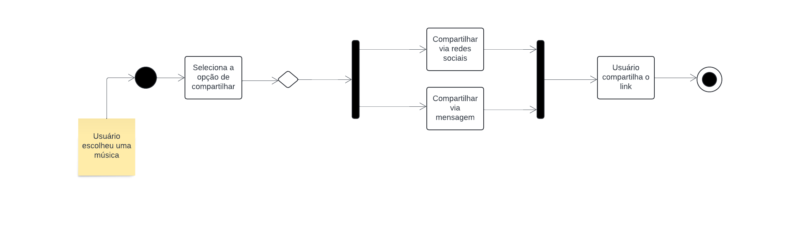

# Visão de Processo

## Introdução

A visão de processo oferece uma perspectiva detalhada sobre o fluxo de atividades e operações no sistema. Este documento tem como objetivo fornecer uma compreensão clara dos processos operacionais e interações no aplicativo de música.

## Metodologia

Após uma reunião com toda a equipe de desenvolvimento do projeto, ficou acordado que os integrantes [Ana Luíza](https://github.com/analuizargds) e [Rafael Xavier](https://github.com/rafaelxavierr) seriam responsáveis por documentar a visão de processo. Eles se reuniram para discutir qual seria a melhor forma de trazer a perspectiva processual para o projeto, chegando a conclusão de que o diagrama de aatividades seria a melhor escolha, por ser de fácil compreensão e atender ao contexto do sistema, visto que pode ser bem representado atráves de ações e atividades.

Já existiam quatro diagramas representando algumas atividades do sistema, que foram elaborados anteriormente pelo integrante [Vinícius Mendes](https://github.com/yabamiah) no documento que pode ser acessado [aqui](https://github.com/UnBArqDsw2024-1/2024.1_G2_My_Music/blob/main/docs/Modelagem/diagramaAtividades.md), e que estão estão apresentados nas figuras 1, 2, 3 e 4. Após a reunião dos integrantes responsáveis pela visão de processo, foi decidido que seriam feitos mais quatro diagramas, a fim de representar de forma mais completa as funcionalidades do sistema. Esses diagramas podem ser vistos nas figuras 5, 6, 7 e 8.

## Visão de Processo

  
  
Figura 1: Diagrama de atividades de cadastro  (Fonte: Vinícius Mendes, 2024)

  
  
Figura 2: Diagrama de atividades de criação de playlist  (Fonte: Vinícius Mendes, 2024)

  
  
Figura 3: Diagrama de atividades de login (Fonte: Vinícius Mendes, 2024)

  
  
Figura 4: Diagrama de atividades de ouvir música (Fonte: Vinícius Mendes, 2024)

  
  
Figura 5: Diagrama de atividades de adicionar música em uma playlist (Fonte: Ana Luíza e Rafael Xavier, 2024)

  
  
Figura 6: Diagrama de atividades de remover música de uma playlist (Fonte: Ana Luíza e Rafael Xavier, 2024)

  
  
Figura 7: Diagrama de atividades de busca (Fonte: Ana Luíza e Rafael Xavier, 2024)

  
  
Figura 8: Diagrama de atividades de compartilhar (Fonte: Ana Luíza e Rafael Xavier, 2024)

## Bibliografia

## Referências Bibliográficas 

## Histórico de versão

| Versão | Data      | Descrição | Autores | Revisor |
| :-:    | :-----:   | :------   | ----  | ------- |
| 1.0    |06/08/2024 | Criação do Documento | [Ana Luíza](https://github.com/analuizargds) e [Rafael Xavier](https://github.com/rafaelxavierr) | [Fulano](hh), [Link da revisão](https://github.com/linkdapagina)  |