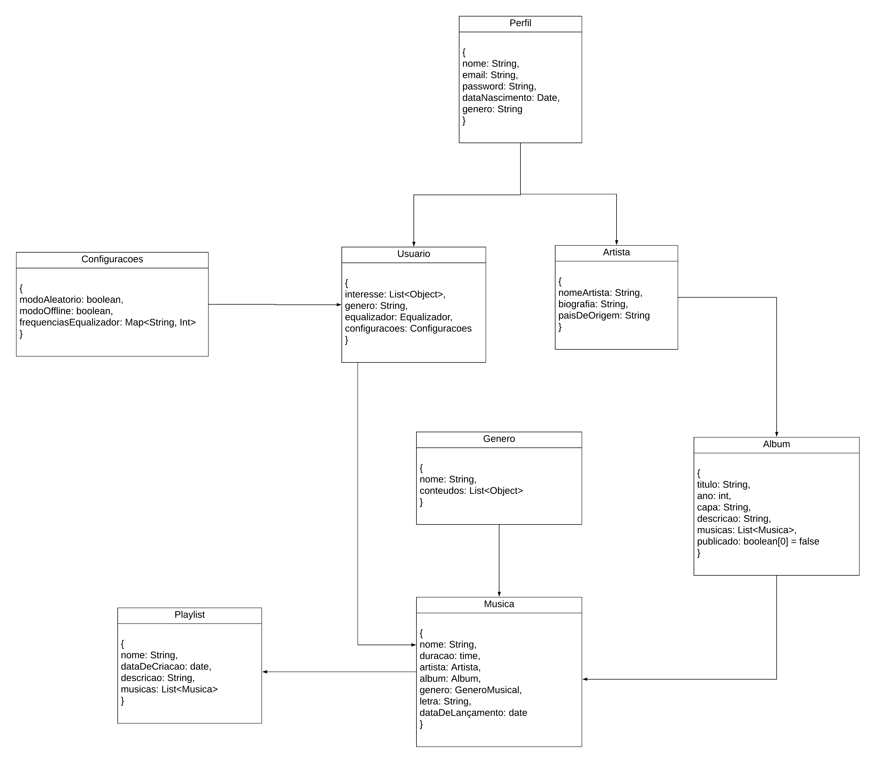

## Introdução

__Visão de Dados__

A visão de dados lida com o armazenamento, a organização e a manipulação das informações dentro do sistema. Ela descreve como os dados são estruturados, acessados e processados, garantindo a integridade, segurança e desempenho adequados.

Essa visão é crucial para projetar uma arquitetura que suporte a gestão eficiente dos dados, permitindo consultas rápidas, escalabilidade e conformidade com as regulamentações vigentes.

*Fonte: https://blog.infnet.com.br/arquitetura_software/principais-visoes-em-arquitetura-de-software/*

No caso da utilização de um Banco de Dados Relacional a visão de dados pode ser um dcoumento de DER ou MER e caso o banco de dados seja não relacional como o caso deste grupo, a diagramação pode ser um artefato genérico.

## Metodologia

Para o desenvolvimento do documento de visão de dados, primeiramente foi feito um estudo inicial de como deve ser esse documento, para o estudo foi utilizado video aulas e slides da professora Milene Serrano. Foi utilizado como base o  [diagrama de classe](https://unbarqdsw2024-1.github.io/2024.1_G2_My_Music/Modelagem/diagramaClasses/) e foi utilizado o site Lucichart.

## Diagrama 

Na figura 1 abaixo, contem a visão de dados.

Figura 1 - Visão de Dados

Autores: [João Vítor](https://github.com/Jvsoutomaior)

## Referências Bibliográficas
> Principais visões em Arquitetura de Software. Disponível em: <https://blog.infnet.com.br/arquitetura_software/principais-visoes-em-arquitetura-de-software/>. Acesso em: 12 agosto 2024.

## Bibliográfia

> Principais visões em Arquitetura de Software. Disponível em: <https://blog.infnet.com.br/arquitetura_software/principais-visoes-em-arquitetura-de-software/>. Acesso em: 05 agosto 2024.
> Artefato: Documento de Arquitetura de Software. Dispomivel em: https://www.cin.ufpe.br/~gta/rup-vc/core.base_rup/workproducts/rup_software_architecture_document_C367485C.html . Acesso em 6 agosto 2024.

## Histórico de Versão

| Versão | Data       | Descrição                                               | Autores                        | Revisores |
| ------ | ---------- | ------------------------------------------------------- | ------------------------------ | --------- |
| 1.0 | 05/08/2024 | Primeira versão | [João Vítor](https://github.com/Jvsoutomaior) | [Luis Miranda](https://github.com/LuisMiranda10) (Link da revisão)[https://github.com/UnBArqDsw2024-1/2024.1_G2_My_Music/pull/84] |
| 1.1 | 12/08/2024 | Adicionando referências bibliográficas e correção de ortografia | [João Vítor](https://github.com/Jvsoutomaior)| [Limírio Guimarães](https://github.com/LimirioGuimaraes) (Link da revisão)[https://github.com/UnBArqDsw2024-1/2024.1_G2_My_Music/pull/84]|
