## Introdução

Na construção de produto, é essencial que haja uma organização entre os membros de uma equipe de forma adaptada a realidades dos mesmos e com o tipo de produto que está sendo desenvolvido, portanto, é importantíssimo que a escolha de modelos de desenvolvimento sejam definidos em conjunto.

A partir disto, a decisão de equipe em conjunto foi abraçar um modelo híbrido de desenvolvimento do projeto, adicionando prática e elementos das metodologias Scrum¹, Kanban² e XP (Extreme Programming)³. A decisão foi tomada levando em conta a quantidade de membros total na equipe, mais a realidade do mesmos.

## Metodologia

Como dito anteriormente, as motivações da escolha das metodologias foram tomadas a partir da quantidade de membros da equipe, mais a realidade dos mesmo. Além disso, também foi levado em conta as experiências que os membros já possuem com tais metodologias.

### Scrum

O Scrum é um framework ágil amplamente utilizado para gerenciamento de projetos, especialmente na área de desenvolvimento de software, mas também aplicável a uma variedade de outros contextos. Ele se baseia em princípios de transparência, inspeção e adaptação, visando a entrega contínua de valor ao cliente de forma iterativa e incremental. No Scrum, as equipes trabalham em ciclos curtos chamados "sprints", que geralmente têm duração de uma a quatro semanas, durante os quais planejam, executam e revisam o trabalho realizado. 

Do Scrum, os artefatos que iremos utilizar são:
- Product Backlog
- Sprint Planning
- Sprint
- Sprint review

### Kanban
Da metodologia Kanban, nos iremos utilizar o quadro de visibilidade, para a organização das tarefas que serão realizadas. Este quadro é uma ferramenta que oferece uma forma estruturar as tarefas com transparência em diferentes níveis ao longo do projeto. 

A ferramenta Kanban será utilizada pelo site Trello¹. 

### XP (Extreme Programming)
A metodologia XP (Extreme Programming) é uma abordagem ágil de desenvolvimento de software que visa melhorar a qualidade do software e a satisfação do cliente através de práticas de engenharia de software. XP enfatiza a comunicação eficaz, feedback rápido, simplicidade, flexibilidade e aceitação de mudanças nos requisitos do cliente. Ela se baseia em valores como comunicação, feedback, simplicidade, coragem e respeito, e inclui práticas como desenvolvimento orientado a testes (TDD), integração contínua, programação em pares, refatoração e design incremental.

Da metodologia XP, nos iremos utilizar os ritos:
- Pareamento: Todos as atividades desenvolvidas deverão ser feitas em par, que irão trabalhar em conjunto.

## Modelagem BPMN
A Modelagem BPMN⁴ (Business Process Model and Notation) é uma abordagem visual para descrever, analisar e otimizar processos de negócios. Ela fornece um conjunto de símbolos e regras padronizadas que permitem aos usuários representar graficamente os processos de negócios de uma organização, desde a captura das atividades realizadas até a identificação dos fluxos de informação e tomada de decisão. 

Sabendo o que é a modelagem BPMN, foram feitos um diagrama BPMN para cada etapa das metodologias escolhidas pela equipe. Para assim, facilitar o acompanhamento de cada etapa e as suas atividades.

Para a criação dos modelos, foi utilizada a ferramento online BPMN.io.

### Modelagem do Scrum
Logo abaixo será apresentado na figura 1 a modelagem do Scrum, no qual foi organizado em uma piscina com duas raias, uma para representar o início do projeto, e a segunda o sprint planning.

 Figura 1: Modelagem BPMN Scrum. (Fonte: Vinícius Mendes, 2024). 

### Modelagem Kanban
Logo abaixo será apresentado na figura 2 a modelagem do Kanban, no qual foi organizado em uma piscina com duas raias, sendo a primeira a organização do Kanban e a segunda execução do Kanban

 Figura 2: Modelagem BPMN Kanban. (Fonte: Vinícius Mendes, 2024). 

### Modelagem XP
Logo abaixo será apresentado na figura 3 a modelagem do XP, no qual foi organizado somente em uma piscina, com uma raia que representa o pareamento.

 Figura 3: Modelagem BPMN XP. (Fonte: Vinícius Mendes, 2024). 

## Referências Bibliográficas
> [1] O que é Scrum? (E como começar). Disponível em: https://www.atlassian.com/br/agile/scrum. Acessado: 07/04/2024.
> 
> [2] Kanban Introduction, Practices, Artifacts, Board, Prcocess and Roles. Disponível em: https://www.toolsqa.com/agile/kanban/. Acessado: 07/04/2024.
> 
> [3] Extreme Programming: What Is It and How Does It Work?. Disponível em: https://www.sydle.com/blog/extreme-programming-what-is-it-and-how-does-it-work-602ee205da4d096809438c9c. Acessado: 07/04/2024.
> 
> [4] Serrano, Milene. Arquitetura e Desenho de Software, AULA - Notação BPMN. Disponível em: https://aprender3.unb.br/pluginfile.php/2790232/mod_label/intro/Arquitetura%20e%20Desenho%20de%20software%20-%20Aula%20BPMN%20Exemplos%20-%20Profa.%20Milene.pdf. Acessado: 07/04/2024.

## Bibliografia
> Serrano, Milene. Arquitetura e Desenho de Software, AULA - Notação BPMN. Disponível em: https://aprender3.unb.br/pluginfile.php/2790232/mod_label/intro/Arquitetura%20e%20Desenho%20de%20software%20-%20Aula%20BPMN%20Exemplos%20-%20Profa.%20Milene.pdf. Acessado: 07/04/2024.

## Histórico de versões
| Versão | Data       | Descrição           | Autor(es)       | Revisor(es) |
| ------ | ---------- | ------------------- | --------------- | ----------- |
| 1.0    | 07/04/2024 | Criação do artefato | [Vinícius Mendes](https://github.com/yabamiah) | [Luis Miranda](https://github.com/LuisMiranda10)            |
| 1.1    | 15/07/2024 | Padronização das legendas | [Ana Luíza Rodrigues](https://github.com/analuizargds) | -            |
