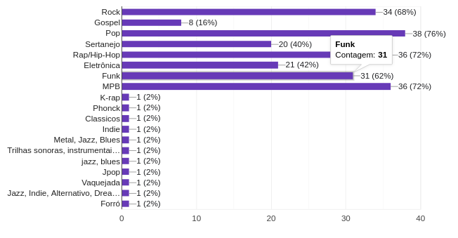

# Questionário
## Introdução
O questionário é uma das principais técnicas tradicionais de elicitação de requisitos, utilizado quando já existe um conhecimento prévio sobre o domínio de negócio a ser abordado e um grande número de usuários, além também de possibilitar análises a partir de estatísticas, apesar de ter uma desvantagem que é a limitação do universo de respostas e pouca interação entre a equipe e os usuário. O questionário é documento estruturado em questões abertas e fechadas, para assim coletar informações organizadas e quantificáveis, o que auxilia na interpretação dos dados obtidos. E como foi dito no começo, o questionário permite que um grande número de usuários consigam responder de forma eficiente.

## Metodologia
A equipe realizou a elaboração de um questionário online através do serviço google forms¹ no dia 05/04/2024, no qual o foco é avaliação dos perfis de usuários que utilizam aplicativos de música. O questionário foi estruturado com 8 perguntas, sendo algumas para conhecer o perfil dos usuários e o restante acerca da experiência e necessidades dos usuários. O questionário foi divulgado em grupo diversos, sendo um deles a comunidade acadêmica da UnB - FGA, através de aplicativos de mensagem Whatsapp e Telegram, entre o período de 05 a 07 de abril de 2024.

### Perguntas Realizadas
A tabela 1 contém a seleção das perguntas utilizadas no questionário.

**Tabela 1** - Perguntas do questionário

| ID  | Pergunta                                                      |
| --- | ------------------------------------------------------------- |
| 1   | Qual a sua idade?                                             |
| 2   | Qual o seu grau de escolaridade?                              |
| 3   | Qual gênero você se identifica?                               |
| 4   | Quais seus gostos musicais?                                   |
| 5   | Como você mais consome música?                                |
| 6   | Como você descobre novas músicas?                             |
| 7   | O que você espera de um aplicativo de música?                 |
| 8   | Você tem alguma outra funcionalidade que gostaria de sugerir? |

Fonte: [Formulário](https://forms.gle/qj2o5261fd45MaEK8) feito pelo grupo 2, 2024.

### Resultado do questionário

O resultado do questionário teve o total de 50 respostas de acordo com o Google-forms. O resultado das respostas serão apresentadas de forma gráfica nas figuras de 1 a 8.

#### Questão 1 - Qual a sua idade?
De acordo com o gráfico apresentado na figura 1 que representa a idade dos usuários, os resultados ficaram:
- 40 usuários possuem idade de 19 a 24 anos
- 6 usuários possuem idade de 25 a 34 anos
- 3 usuários possuem até 18 anos idade
- 1 usuário possui 61 ou mais anos de idade

**Figura 1** - Pergunta 1.

Fonte: [Formulário](https://forms.gle/qj2o5261fd45MaEK8) feito pelo grupo 2, 2024.

#### Questão 2 - Qual a sua escolaridade?
De acordo com o gráfico apresentado na figura 2 que representa o grau de escolaridade dos usuário, os resultados foram:
- 43 usuários possuem o ensino superior completo ou ainda estão cursando
- 7 usuários possuem o ensino médio completo ou ainda estão cursando

**Figura 2** - Pergunta 2.

Fonte: [Formulário](https://forms.gle/qj2o5261fd45MaEK8) feito pelo grupo 2, 2024.

#### Questão 3 - Qual gênero você se identifica?
A quantidade de usuários que se identificam do gênero feminino são 25 usuários, 24 usuários se identificam com o gênero masculino 1 prefere não dizer.

**Figura 3** - Pergunta 3.

Fonte: [Formulário](https://forms.gle/qj2o5261fd45MaEK8) feito pelo grupo 2, 2024.

#### Questão 4 - Quais seus gostos musicais?
De acordo com a figura 4, o gênero musical mais votado é o Pop com 38 usuários.

**Figura 4** - Pergunta 4.

Fonte: [Formulário](https://forms.gle/qj2o5261fd45MaEK8) feito pelo grupo 2, 2024.

#### Questão 5 - Como você mais consome música no dia a dia?
Analisando a figura 5, a maioria dos usuários consomem música por aplicativos de streaming de música, e o meio menos utilizado é o de mídia física.

**Figura 5** - Pergunta 5

Fonte: [Formulário](https://forms.gle/qj2o5261fd45MaEK8) feito pelo grupo 2, 2024.

#### Questão 6 - Como você descobre novas músicas?
De acordo com a figura 6, a maioria dos usuários (21 pessoas) descobrem músicas novas a partir de recomendações automáticas de aplicativos de música.

**Figura 6** - Pergunta 6

Fonte: [Formulário](https://forms.gle/qj2o5261fd45MaEK8) feito pelo grupo 2, 2024.

#### Questão 7 - O que você espera de um aplicativo de streaming de música?
De acordo com a figura 7, as funcionalidades que os usuários mais esperam de um aplicativo de música são (mais da metade dos usuários (25) responderam como muito relevante)
- Ouvir música, 46 usuários julgaram como muito relevante.
- Conseguir ouvir música offline, 44 usuário julgaram como muito relevante.
- Pesquisar músicas/artistas/playlist's/álbuns, 37 usuários julgaram como muito relevante.
- Montar playlist's, 33 usuários julgaram como muito relevante.
- Montar uma fila de reprodução, 27 usuários julgaram como muito relevante.

**Figura 7** - Pergunta 7

Fonte: [Formulário](https://forms.gle/qj2o5261fd45MaEK8) feito pelo grupo 2, 2024.

#### Questão 8 - Você tem alguma outra funcionalidade que gostaria de sugerir?
Analisando a figura 8, 12 usuários sugeriram outras funcionalidades além do que o formulário já cobria, que foram:

- Controlar a musica pra tocar em vários dispositivos;
- Conseguir ler as letras da música. Traduções etc;
- Letra das músicas disponíveis ao tocá-las;
- Ver as músicas e playlists curtidas;
- Letra da música, cifras, separar faixas e controlá-las (todas essas seriam boas para músicos praticarem utilizando o próprio app de streaming);
- Eu queria muito poder salvar as músicas em alguma nuvem, pq eu escuto música off-line mais acabo baixando no meu celular e isso é muito ruim;
- Monetização de reprodução de plays nas músicas para os artistas envolvidos na composição destas.Upload de sets;
- algoritmo que cria playlists pra você ouvir conforme “estado de espírito” de acordo com seus próprios gostos, por ex: “lavar a casa”, “tô triste”, “tô indo dormir” etc, personalizado individualmente e tal, seria top;
- Escutar música com outras pessoas através do app;
- Possibilidade de ver a letra da música (se possível com tradução), compartilhar músicas, fazer buscas pela letra da música;
- Chat de texto para poder recomendar músicas para amigos;
- playlist de download automática pelas mais ouvidas, com opção de quantas musicas quwr “playlist offline”;

**Figura 8** - Pergunta 8

Fonte: [Formulário](https://forms.gle/qj2o5261fd45MaEK8) feito pelo grupo 2, 2024.

## Referência bibliográfica
>  Google LLC. Google Forms. Disponível em: [https://www.google.com/intl/pt-BR/forms/about/](https://www.google.com/intl/pt-BR/forms/about/). Acesso em: 05/04/2024.

## Bibliografia 
> Ferreira, Daniel. Métodos e Técnicas de Elicitação de Requisitos e sua Aderência ao CMMi. Pernambuco, Universidade Federal de Pernambuco, 2012. Acesso em: 07/04/2024.
>
> BARBOSA, S. D. J.; SILVA, B. S. Interação Humano-Computador. Rio de Janeiro: Elsevier, 2011. Acesso em:  07/04/2024.

## Histórico de versões

| Versão | Data       | Descrição                         | Autor(es)       | Revisor(es) |
| ------ | ---------- | --------------------------------- | --------------- | ----------- |
| 1.0    | 07/04/2024 | Criação do documento questionário | Vinícius Mendes |             |

