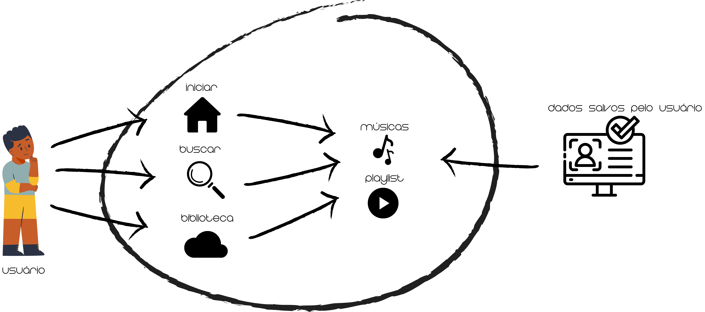

# Rich Picture

## Introdução

Um "Rich Picture" é uma representação visual que combina elementos gráficos e textuais para capturar de forma abrangente e holística a complexidade de um problema, sistema ou situação. No contexto da engenharia de software, ele é utilizado para abstrair o funcionamento de sistemas de software e se apresenta na forma de um diagrama com alguns elementos básicos como: atores, processos, armazenamento de dados, setas e limites do sistema.

## Ferramentas Utilizadas

Para construção do Rich Picture utilizado nas figuras 1 foi utilizada a ferramenta do canvas, e logo abaixo temos a legenda com a explicação dos itens utilizados, figura 2.

## Rich Picture

  
Figura 1: Rich Picture. (Fonte: Milena Baruc, 2024)

  
Figura 2: Legenda. (Fonte: Milena Baruc, 2024)

## Bibliografia 

> KLAUS POHL, RUPP CHRIS. Requirements Engineering Fundamentals. 2nd Edition, 2015.

## Histórico de versões:

| Versão | Data       | Descrição                         | Autor(es)       | Revisor(es) |
| ------ | ---------- | --------------------------------- | --------------- | ----------- |
| 1.0    | 07/04/2024 | Criação do documento rich picture | [Milena Baruc](https://github.com/MilenaBaruc)    |  [Vinícius Mendes](https://github.com/yabamiah)|
| 1.1    | 15/07/2024 | Padronização das legendas | [Ana Luíza Rodrigues](https://github.com/analuizargds)    |  - |
