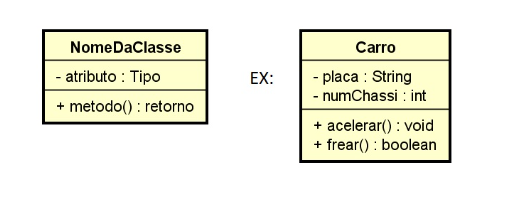

## Introdução

É um diagrama estático da UML que reúne os elementos mais importantes de um sistema orientado a objetos. Nele são exibidos um conjunto de classes, 
interfaces e seus relacionamentos. As classes especificam tanto as propriedades quanto os comportamentos dos objetos. Nesta seção será apresentado 
o diagrama de classe do app MyMusic, especificando todas as classes (com seus atributos e operações) e os relacionamentos¹. Apesar de ser uma 
modelagem essencial para o desenvolvimento do projeto, ela pode sofrer alterações.

## Metodologia

Para realizar a modelagem do Diagrama de Classe, a equipe utilizou a ferramenta [LucidChart](https://www.lucidchart.com/pages/pt),um site de modelagem de diagramas, que permite ao seus clientes utilizarem a linguagem UML e oferece um serviço de compartilhamento ao vivo com outros usuários.
A modelagem foi feita seguindo o seguinte padrão apresentado na figura 1:

  
  
Figura 1: Exemplo de classe (Fonte: SpaceProgrammer, 2017)²

## Diagrama de classe   

Na figura 2, temos o diagrama de classes elaborado para o aplicativo. Para melhor avaliação do diagrama acessar o [link.](https://lucid.app/lucidchart/31c29fc7-aa1c-4aa6-9230-582034a77ddf/edit?viewport_loc=-1696%2C-1484%2C6656%2C3352%2CHWEp-vi-RSFO&invitationId=inv_8d8d08ce-dac2-47f2-92ec-4f110c1a106d)

  
  
Figura 2: Diagrama de classes do aplicativo My Music  (Fonte: Ana Luíza Rodrigues e Rafael Xavier, 2024)

## Referências Bibliográficas

> ¹ UML Class and Object Diagrams Overview. Disponível em: <https://www.uml-diagrams.org/class-diagrams-overview.html>. Acesso em 06/07/2024

> ² Disponível em <https://spaceprogrammer.com/uml/introducao-as-classes-associacoes-e-generalizacoes/>. Acesso em 06/07/2024.

## Histórico de Versão

| Versão  | Data       | Descrição                  | Autor                    | Revisor   |
|---------|------------|----------------------------|-------------|-----------|
| 1.0     | 06/07/2024 | Criação do documento | [Ana Luíza Rodrigues](https://www.github.com/analuizargds) e [Rafael Xavier](https://www.github.com/rafaelxavierr) | [João Vitor](https://www.github.com/Jvsoutomaior) |
| 1.1     | 09/07/2024 | Alterando o diagrama segundo apontamentos do revisor | [Ana Luíza Rodrigues](https://www.github.com/analuizargds) e [Rafael Xavier](https://www.github.com/rafaelxavierr) | [João Vitor](https://www.github.com/Jvsoutomaior) |