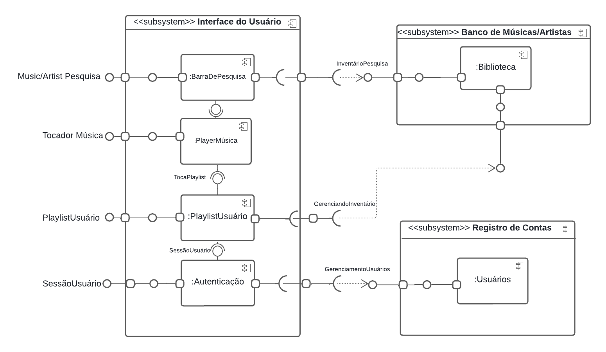

# Diagrama de Componentes

## Introdução

O diagrama de componentes da UML demonstra a organização das classes em termos de componentes de trabalho. Ele especifica, por exemplo, quais classes são representadas por cada componente. Esse diagrama é utilizado para modelar dados tanto do código fonte quanto do código executável do software. Mas por que fazer o diagrama? Para responder essa pergunta temos três pontos:

- Ajuda a ter uma visão de alto nível, direcionamento a como montar a aplicação
- Definir plano de escala
- Ajuda a fazer um plano de distribuição, plano de entrega do produto

## Metodologia

Para realizar a modelagem do Diagrama de Componentes, a equipe utilizou a ferramente [LucidChart](https://www.lucidchart.com/pages/pt), que é um site de modelagem de diagramas, que permite ao seus clientes utilizarem a linguagem UML e oferece um serviço de compartilhamento ao vivo com outros usuários.

## Diagrama de Componentes

Logo abaixo é apresentado o diagrama (figura 1) em que representa o relacionamento entre diferentes componentes de subsistemas independentes.

**Fonte**: [Luis Miranda](https://github.com/LuisMiranda10) & [Milena Baruc](https://github.com/MilenaBaruc)

## Referências Bibliográficas

1. WIKIPEDIA. Diagrama de componentes. Wikipedia, 2024. Disponível em: https://pt.wikipedia.org/wiki/Diagrama_de_componentes. Acesso em: 06 jul. 2024.
2. Pisani da ArcH. Diagrama de Componentes. YouTube, 2023. Disponível em: https://youtu.be/yjFpwFZHGtw?si=fWfoXAkt2zvV0PuC. Acesso em: 06 jul. 2024.

## Histórico de versões 

|   Versão  |    Data   | Descrição | Autor(es) | Revisor(es)|
| --------- | --------- | --------- | --------- | ---------- |
|   `1.0`   | 06/07/2023| Criação da página | [Luis Miranda](https://github.com/LuisMiranda10) & [Milena Baruc](https://github.com/MilenaBaruc) | |