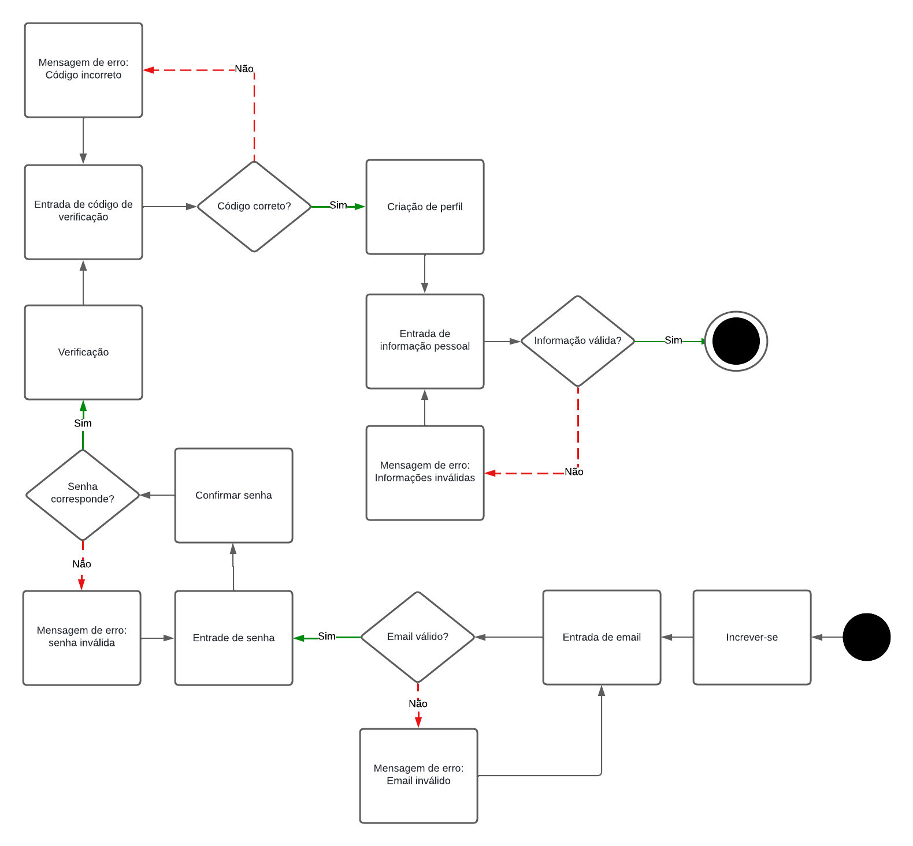
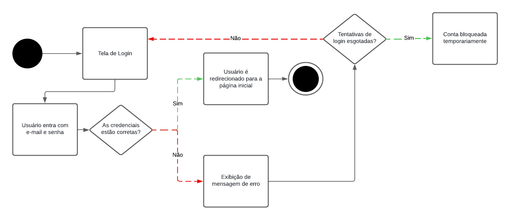
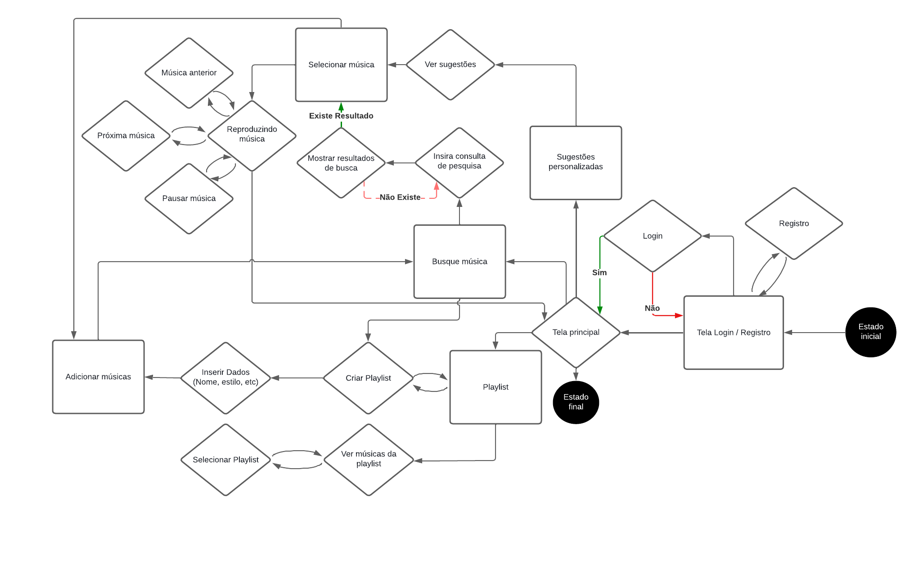

# Diagrama de Estados
## Introdução

O diagrama de estados em UML (Unified Modeling Language) é utilizado para descrever o comportamento dinâmico de um sistema, especificamente como os objetos respondem a eventos, mudando de um estado para outro. É uma ferramenta poderosa para capturar e comunicar o comportamento dinâmico dos sistemas, facilitando a análise, o design e a implementação de soluções complexas.

## Metodologia
Para realizar a modelagem do Diagrama de Estados, a equipe utilizou a ferramenta [LucidChart](https://www.lucidchart.com/pages/pt), que é um site de modelagem de diagramas, que permite ao seus clientes utilizarem a linguagem UML e oferece um serviço de compartilhamento ao vivo com outros usuários.

## Diagramas de Estados
Logo abaixo você encontra as figuras que representam o comportamento do aplicativo My Music em diagramas de estados.

### Cadastro
A figura 1 a seguir representa a modelagem de etapa de cadastro no aplicativo My Music.

**Figura 1** - Diagrama de Estados do cadastro

Fonte: Lucas Vilela, Henrique Hida, Luiz Guilherme,  2024.

### Diagrama de Login
A figura 2 a seguir representa a modelagem da atividade de login no aplicativo My Music.

**Figura 2** - Diagrama de login

Fonte: Lucas Vilela, Henrique Hida, Luiz Guilherme, 2024.

### Diagrama de  Música
A figura 3 a seguir representa a modelagem da atividade de ouvir música, seja acessando-a diretamente, ou indiretamente através de artista/álbum/playlist ou nas recomendações do usuário.

**Figura 3** - Diagrama de ouvir música

Fonte: Lucas Vilela, Henrique Hida, Luiz Guilherme, 2024.

## Bibliografia 
> The Unified Modeling Languag Org., 2011. Disponível em: https://www.uml-diagrams.org/. Acesso em: 06 de Julho.

## Histórico de versões

| Versão | Data       | Descrição                                   | Autor(es)       | Revisor(es) |
| ------ | ---------- | ------------------------------------------- | --------------- | ----------- |
| 1.0    | 08/07/2024 | Criação do documento Diagrama de Estados | [Lucas Vilela](https://github.com/Lucas-AV), [Henrique Hida](https://github.com/HenriqueHida), [Luiz Guilherme](https://github.com/luizpettengill)  |             |     |
