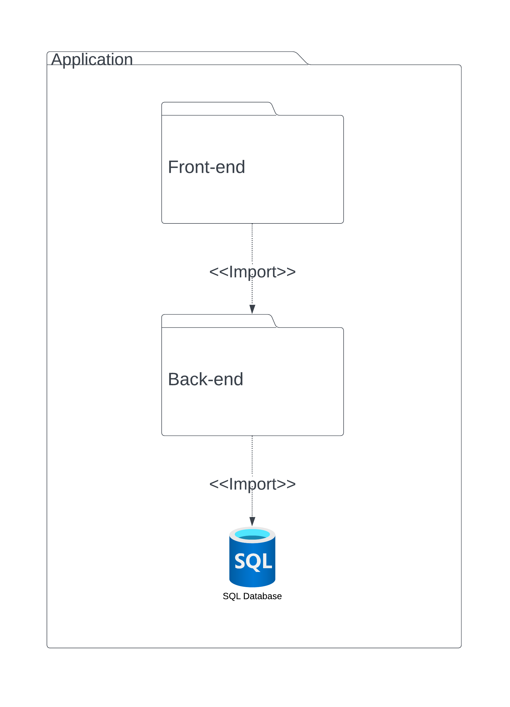

# Diagrama de Pacotes

## Introdução

**O que é um diagrama de pacotes UML?**

Diagramas de pacotes são diagramas estruturais usados para mostrar, em uma forma de pacotes, a organização e disposição de vários elementos de modelos. Um pacote é um agrupamento de elementos UML relacionados, como diagramas, documentos, classes ou até mesmo outros pacotes. Cada elemento é colocado dentro do pacote e é representado como uma pasta de arquivo dentro do diagrama, e depois organizado hierarquicamente no diagrama. Diagramas de pacotes são bastante usados para proporcionar uma organização visual de uma arquitetura em camadas de qualquer classificador UML, por exemplo, um sistema de software.

*Fonte: [lucidchart.com/pages/pt/diagrama-de-pacotes-uml](https://www.lucidchart.com/pages/pt/diagrama-de-pacotes-uml)*

## Metodologia

Para realizar a modelagem do Diagrama de Pacotes, a equipe utilizou a ferramente [LucidChart](https://www.lucidchart.com/pages/pt), que é um site de modelagem de diagramas, que permite ao seus clientes utilizarem a linguagem UML e oferece um serviço de compartilhamento ao vivo com outros usuários.

## Diagrama de Pacotes

### Visão Geral

Logo abaixo é apresentado o diagrama (figura 1) em que representa a visão geral do diagrama de pacotes

**Fonte**: [João Maior](https://github.com/Jvsoutomaior)

### Visão mais detalhada do Frontend e Backend

Note que essa visão detalhada é apenas um escopo inicial e ainda sera refatorado ao longo do desenvolvimento do projeto, note tambem que nessa visão não inclui o a camada de banco de dados.

**Fonte**: [João Maior](https://github.com/Jvsoutomaior)

## Referências Bibliográficas

1. Lucidchart, Diagrama de componentes, 2024. Disponível em: https://www.lucidchart.com/pages/pt/diagrama-de-pacotes-uml. Acesso em: 08 jul. 2024.

## Histórico de versões 

|   Versão  |    Data   | Descrição | Autor(es) | Revisor(es)|
| --------- | --------- | --------- | --------- | ---------- |
|   `1.0`   | 08/07/2023| Criação da página | [João Maior](https://github.com/Jvsoutomaior) | - |
