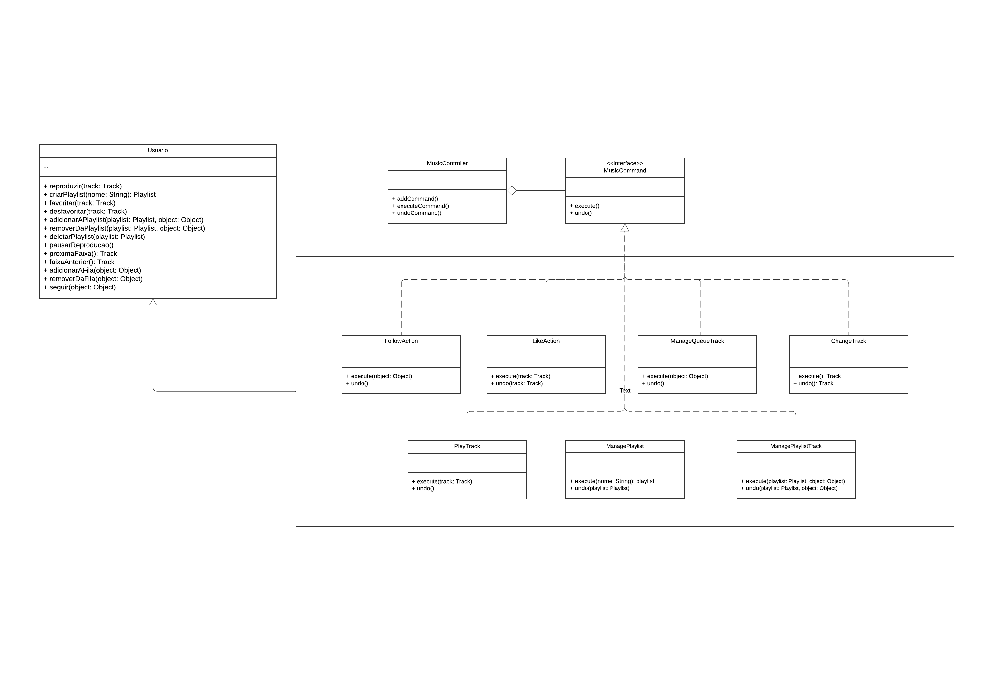

## 3.2.2 GoFs Comportamentais
Os padrões GoF comportamentais têm como objetivo facilitar a comunicação e a responsabilidade entre os objetos de um sistema, promovendo interações mais eficientes e flexíveis. Esses padrões focam nas formas como os objetos interagem e distribuem responsabilidades, facilitando a implementação de algoritmos e a troca de informações. O GoF comportamental inclui onze padrões: Chain of Responsibility, Command, Interpreter, Iterator, Mediator, Memento, Observer, State, Strategy, Template Method e Visitor. 

No contexto do nosso projeto, focaremos nos padrões Command e Strategy.

### Metodologia

Para realização deste artefato, foi criado um subgrupo de cinco pessoas: [Ana Luíza Rodrigues](https://github.com/analuizargds), [Carlos Daniel de Godoy](https://github.com/CDGodoy), [Carlos Eduardo Mendes](https://github.com/CarlosEduardoMendesdeMesquita), [João Vítor Motta](https://github.com/Jvsoutomaior) e [Rafael Xavier](https://github.com/rafaelxavierr). Onde [Ana Luíza Rodrigues](https://github.com/analuizargds) e [Rafael Xavier](https://github.com/rafaelxavierr) modelaram o padrão Command enquanto [Carlos Daniel de Godoy](https://github.com/CDGodoy), [Carlos Eduardo Mendes](https://github.com/CarlosEduardoMendesdeMesquita) e [João Vítor Motta](https://github.com/Jvsoutomaior) modelaram o padrão Strategy.

## 3.2.2.1 Command
### Introdução
O Command é um padrão comportamental que transforma uma solicitação em um objeto, permitindo que o cliente parametrize outros objetos com diferentes solicitações, enfileire ou registre solicitações e suporte operações que podem ser desfeitas. Esse padrão é útil em cenários onde precisamos que as solicitações sejam tratadas como objetos, permitindo que possamos armazená-las, passá-las como parâmetros e registrá-las para execução posterior.

No nosso aplicativo, o padrão Command será extremamente útil para implementar funcionalidades como a criação de playlists, adição e remoção de músicas, e operações de desfazer/refazer. Por exemplo, ao adicionar ou remover músicas de uma playlist, podemos encapsular essas ações como objetos de comando, permitindo que o usuário desfaça ou refaça essas ações conforme necessário. Isso melhora a usabilidade e a experiência do usuário.

### Estrutura

O padrão Command segue a seguinte estrutura mostrada na Figura 1.

<div style="text-align: center">
  
  <p>Figura 1: Estrutura do padrão Command (Fonte: Refactoring Guru, 2014-2024)</p>
</div>

1. **Remetente (Invocador)**
   - A classe Remetente é responsável por iniciar os pedidos. Ela deve ter um campo para armazenar a referência para um objeto comando. O remetente aciona aquele comando ao invés de enviar o pedido diretamente para o destinatário. Observe que o remetente não é responsável por criar o objeto comando. Geralmente ele é pré-criado através de um construtor do cliente.

2. **Interface Comando**
   - A interface Comando geralmente declara apenas um único método para executar o comando.

3. **Comandos Concretos**
   - Comandos Concretos implementam vários tipos de pedidos. Um comando concreto não deve realizar o trabalho por conta própria, mas passar a chamada para um dos objetos da lógica do negócio. Contudo, para simplificar o código, essas classes podem ser fundidas.
   - Os parâmetros necessários para executar um método em um objeto destinatário podem ser declarados como campos no comando concreto. Você pode tornar os objetos comando imutáveis ao permitir que apenas inicializem esses campos através do construtor.

4. **Destinatária**
   - A classe Destinatária contém a lógica do negócio. Quase qualquer objeto pode servir como um destinatário. A maioria dos comandos apenas lida com os detalhes de como um pedido é passado para o destinatário, enquanto que o destinatário em si executa o verdadeiro trabalho.

5. **Cliente**
   - O Cliente cria e configura objetos comando concretos. O cliente deve passar todos os parâmetros do pedido, incluindo uma instância do destinatário, para o construtor do comando. Após isso, o comando resultante pode ser associado com um ou múltiplos destinatários.

### Modelagem

Para a modelagem do padrão Command, os integrantes se reuníram através de uma chamada no Discord, onde decidiram que usariam o padrão visando a classe `Usuário` que possui os métodos responsáveis por ações como reproduzir/pausar uma música/podcast, adicionar/remover músicas em uma `Playlist` ou na fila de reprodução e etc. Em suma são ações que podem ser feitas e desfeitas, que é o maior foco do padrão. A seguir, na Figura 2, podemos ver a modelagem feita baseada no padrão comportamental Command do nosso aplicativo My Music.

<div style="text-align: center">
  
  <p>Figura 2: Modelagem do padrão Command (Fonte: Ana Luíza e Rafael Xavier, 2024)</p>
</div>

O desenvolvimento da implementação foi realizado em paralelo com a modelagem, sendo conduzido e dividido da mesma forma entre os membros da equipe. Esta implementação foi feita de forma colaborativa através da plataforma Discord, utilizando como referência o site [Dart Academy](https://dart.academy/creational-design-patterns-for-dart-and-flutter-factory-method/)³, que possui exemplos de implementações em diversas linguagens de programação.

Primeiro, foi criado um pseudocódigo para entender de maneira simplificada a lógica e a estrutura do código, que pode ser visualizado no Código 1. Em seguida, o pseudocódigo foi traduzido para a linguagem Dart, escolhida pela equipe para o desenvolvimento do projeto.

```dart

```


## Histórico de Versões

| Versão | Data       | Descrição                                               | Autores                        | Revisores |
| ------ | ---------- | ------------------------------------------------------- | ------------------------------ | --------- |
| 0.1    | 24/07/2024 | Criação do documento e adicionando sobre Command |  [Ana Luíza Rodrigues](https://github.com/analuizargds) e [Rafael Xavier](https://github.com/rafaelxavierr) |           |