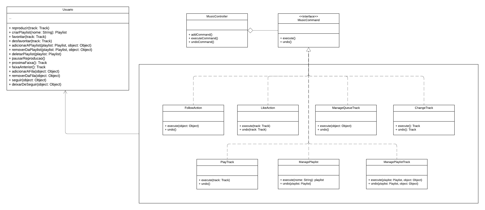
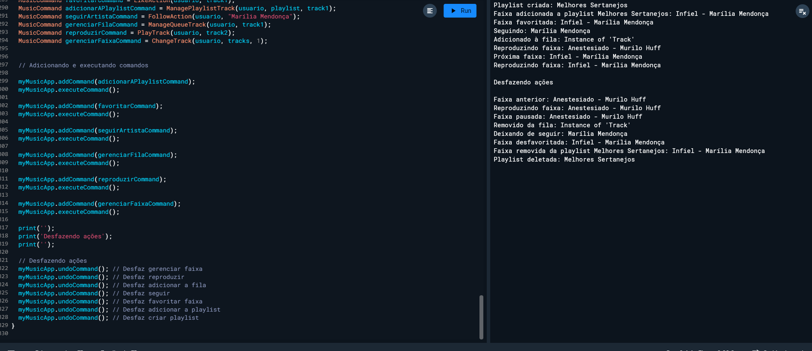

Os padrões GoF comportamentais têm como objetivo facilitar a comunicação e a responsabilidade entre os objetos de um sistema, promovendo interações mais eficientes e flexíveis. Esses padrões focam nas formas como os objetos interagem e distribuem responsabilidades, facilitando a implementação de algoritmos e a troca de informações. O GoF comportamental inclui onze padrões: Chain of Responsibility, Command, Interpreter, Iterator, Mediator, Memento, Observer, State, Strategy, Template Method e Visitor. 

No contexto do nosso projeto, focaremos nos padrões Command e Strategy.

## Metodologia

Para realização deste artefato, foi criado um subgrupo de cinco pessoas: [Ana Luíza Rodrigues](https://github.com/analuizargds), [Carlos Daniel de Godoy](https://github.com/CDGodoy), [Carlos Eduardo Mendes](https://github.com/CarlosEduardoMendesdeMesquita), [João Vítor Motta](https://github.com/Jvsoutomaior) e [Rafael Xavier](https://github.com/rafaelxavierr). Onde [Ana Luíza Rodrigues](https://github.com/analuizargds) e [Rafael Xavier](https://github.com/rafaelxavierr) modelaram o padrão Command enquanto [Carlos Daniel de Godoy](https://github.com/CDGodoy), [Carlos Eduardo Mendes](https://github.com/CarlosEduardoMendesdeMesquita) e [João Vítor Motta](https://github.com/Jvsoutomaior) modelaram o padrão Strategy.

##  Command

O padrão Command encapsula uma solicitação como um objeto, permitindo que você parametrize clientes com diferentes solicitações, enfileire ou registre solicitações e implemente recursos de cancelamento de operações. Ele também promove o desacoplamento entre emissor e receptor de uma solicitação. Em outras palavras, o padrão Command permite que você transforme operações em objetos, tornando-os mais flexíveis e independentes do sistema que as utiliza.¹

No nosso aplicativo, o padrão Command será extremamente útil para implementar funcionalidades como a criação de playlists, adição e remoção de músicas, e operações de desfazer/refazer. Por exemplo, ao adicionar ou remover músicas de uma playlist, podemos encapsular essas ações como objetos de comando, permitindo que o usuário desfaça ou refaça essas ações conforme necessário. Isso melhora a usabilidade e a experiência do usuário.

### Estrutura

O padrão Command segue a seguinte estrutura mostrada na Figura 1.

<div style="text-align: center">
  
  <p>Figura 1: Estrutura do padrão Command (Fonte: Refactoring Guru, 2014-2024)²</p>
</div>

1. **Remetente (Invocador)**

    - A classe Remetente é responsável por iniciar os pedidos. Ela deve ter um campo para armazenar a referência para um objeto comando. O remetente aciona aquele comando ao invés de enviar o pedido diretamente para o destinatário. Observe que o remetente não é responsável por criar o objeto comando. Geralmente ele é pré-criado através de um construtor do cliente.

2. **Interface Comando**
    - A interface Comando geralmente declara apenas um único método para executar o comando.

3. **Comandos Concretos**
    - Comandos Concretos implementam vários tipos de pedidos. Um comando concreto não deve realizar o trabalho por conta própria, mas passar a chamada para um dos objetos da lógica do negócio. Contudo, para simplificar o código, essas classes podem ser fundidas.
    - Os parâmetros necessários para executar um método em um objeto destinatário podem ser declarados como campos no comando concreto. Você pode tornar os objetos comando imutáveis ao permitir que apenas inicializem esses campos através do construtor.

4. **Destinatária**
    - A classe Destinatária contém a lógica do negócio. Quase qualquer objeto pode servir como um destinatário. A maioria dos comandos apenas lida com os detalhes de como um pedido é passado para o destinatário, enquanto que o destinatário em si executa o verdadeiro trabalho.

5. **Cliente**
    - O Cliente cria e configura objetos comando concretos. O cliente deve passar todos os parâmetros do pedido, incluindo uma instância do destinatário, para o construtor do comando. Após isso, o comando resultante pode ser associado com um ou múltiplos destinatários.

### Modelagem

Para a modelagem do padrão Command, os integrantes se reuniram através de uma chamada no Discord, onde decidiram que usariam o padrão visando a classe `Usuário` que possui os métodos responsáveis por ações como reproduzir/pausar uma música/podcast, adicionar/remover músicas em uma `Playlist` ou na fila de reprodução e etc. Em suma são ações que podem ser feitas e desfeitas, que é o maior foco do padrão. A seguir, na Figura 2, podemos ver a modelagem feita baseada no padrão comportamental Command do nosso aplicativo My Music. Para melhor avaliação do diagrama acessar o [link.](https://lucid.app/lucidchart/fccf9c9b-ae0a-421d-b6cd-ec6e33331cf0/edit?viewport_loc=170%2C404%2C3328%2C1676%2CHWEp-vi-RSFO&invitationId=inv_4e8c6c76-eb97-43b4-a5e2-68be5f711cb5)

<div style="text-align: center">
  
  <p>Figura 2: Modelagem do padrão Command (Fonte: Ana Luíza e Rafael Xavier, 2024)</p>
</div>

No diagrama, podemos ver que a classe `Usuario` possui vários métodos que se encaixam no padrão desfazer e refazer, por esse motivo escolhemos o padrão Command para a classe `Usuario` no aplicativo. Essa abordagem serve para desacoplar o solicitante do executor, facilitando a implementação de funcionalidades desfazer e fazer. As ações do usuário, como reproduzir, criarPlaylist, e favoritar, são encapsuladas em comandos específicos, permitindo que o MusicController gerencie eficientemente a execução e a reversão dessas ações. Isso torna o sistema mais organizado.

### Implementação

O desenvolvimento da implementação foi realizado em paralelo com a modelagem, sendo conduzido e dividido da mesma forma entre os membros da equipe. Esta implementação foi feita de forma colaborativa através da plataforma Discord, utilizando como referência o site [Dart Academy](https://dart.academy/creational-design-patterns-for-dart-and-flutter-factory-method/)3, que possui exemplos de implementações em diversas linguagens de programação.

Baseado na modelagem foram desenvolvidos os códigos de cada classe que podem ser visualizado nos códigos de 1 a 4. Os códigos foram feitos na linguagem Dart, escolhida pela equipe para o desenvolvimento do projeto. É importante ressaltar que esses são códigos simplificados e que vão ser desenvolvidos ao longo do projeto.

```dart

class Usuario {
  List<Playlist> playlists = [];
  List<Track> favoriteTracks = [];
  List<Object> queue = [];

  void reproduzir(Track track) {
    track.play();
  }

  Playlist criarPlaylist(String nome) {
    final playlist = Playlist(nome);
    playlists.add(playlist);
    print("Playlist criada: $nome");
    return playlist;
  }

  void favoritar(Track track) {
    favoriteTracks.add(track);
    print("Faixa favoritada: ${track.name}");
  }

  void desfavoritar(Track track) {
    favoriteTracks.remove(track);
    print("Faixa desfavoritada: ${track.name}");
  }

  void adicionarAPlaylist(Playlist playlist, Track track) {
    playlist.addTrack(track);
  }

  void removerDaPlaylist(Playlist playlist, Track track) {
    playlist.removeTrack(track);
  }

  void deletarPlaylist(Playlist playlist) {
    playlists.remove(playlist);
    print("Playlist deletada: ${playlist.name}");
  }

  void pausarReproducao(Track track) {
    track.pause();
  }

  Track proximaFaixa(List<Track> tracks, int currentIndex) {
    Track nextTrack = tracks[(currentIndex + 1) % tracks.length];
    print("Próxima faixa: ${nextTrack.name}");
    return nextTrack;
  }

  Track faixaAnterior(List<Track> tracks, int currentIndex) {
    Track previousTrack = tracks[(currentIndex - 1 + tracks.length) % tracks.length];
    print("Faixa anterior: ${previousTrack.name}");
    return previousTrack;
  }

  void adicionarAFila(Track track) {
    queue.add(track);
    print("Adicionado à fila: $track");
  }

  void removerDaFila(Track track) {
    queue.remove(track);
    print("Removido da fila: $track");
  }

  void seguir(Object object) {
    print("Seguindo: $object");
  }

  void deixarDeSeguir(Object object) {
    print("Deixando de seguir: $object");
  }
}

```
<center>
Código 1: Código do Receiver. (Fonte: Ana Luíza e Rafael Xavier, 2024)
</center>

``` dart
abstract class MusicCommand {
  void execute();
  void undo();
}

```
<center>
Código 2: Código do Command. (Fonte: Ana Luíza e Rafael Xavier, 2024)
</center>

```dart
class MusicController {
  final List<MusicCommand> _commandHistory = [];
  final List<MusicCommand> _undoHistory = [];

  void addCommand(MusicCommand command) {
    _commandHistory.add(command);
  }

  void executeCommand() {
    if (_commandHistory.isNotEmpty) {
      final command = _commandHistory.removeLast();
      command.execute();
      _undoHistory.add(command);
    }
  }

  void undoCommand() {
    if (_undoHistory.isNotEmpty) {
      final command = _undoHistory.removeLast();
      command.undo();
    }
  }
}

```
<center>
Código 3: Código do Invoker. (Fonte: Ana Luíza e Rafael Xavier, 2024)
</center>

``` dart
class FollowAction implements MusicCommand {
  final Usuario usuario;
  final Object object;

  FollowAction(this.usuario, this.object);

  @override
  void execute() {
    usuario.seguir(object);
  }

  @override
  void undo() {
    usuario.deixarDeSeguir(object);
  }
}

class LikeAction implements MusicCommand {
  final Usuario usuario;
  final Track track;

  LikeAction(this.usuario, this.track);

  @override
  void execute() {
    usuario.favoritar(track);
  }

  @override
  void undo() {
    usuario.desfavoritar(track);
  }
}

class ManageQueueTrack implements MusicCommand {
  final Usuario usuario;
  final Track track;

  ManageQueueTrack(this.usuario, this.track);

  @override
  void execute() {
    usuario.adicionarAFila(track);
  }

  @override
  void undo() {
    usuario.removerDaFila(track);
  }
}

class ChangeTrack implements MusicCommand {
  final Usuario usuario;
  final List<Track> tracks;
  int currentIndex;

  ChangeTrack(this.usuario, this.tracks, this.currentIndex);

  @override
  void execute() {
    Track nextTrack = usuario.proximaFaixa(tracks, currentIndex);
    currentIndex = tracks.indexOf(nextTrack);
    usuario.reproduzir(nextTrack);
  }

  @override
  void undo() {
    Track previousTrack = usuario.faixaAnterior(tracks, currentIndex);
    currentIndex = tracks.indexOf(previousTrack);
    usuario.reproduzir(previousTrack);
  }
}


class PlayTrack implements MusicCommand {
  final Usuario usuario;
  final Track track;

  PlayTrack(this.usuario, this.track);

  @override
  void execute() {
    usuario.reproduzir(track);
  }

  @override
  void undo() {
    usuario.pausarReproducao(track);
  }
}

class ManagePlaylist implements MusicCommand {
  final Usuario usuario;
  final String nome;
  Playlist? playlist;

  ManagePlaylist(this.usuario, this.nome);

  @override
  void execute() {
    playlist = usuario.criarPlaylist(nome);
  }

  @override
  void undo() {
    if (playlist != null) {
      usuario.deletarPlaylist(playlist!);
    }
  }
}

class ManagePlaylistTrack implements MusicCommand {
  final Usuario usuario;
  final Playlist playlist;
  final Track track;

  ManagePlaylistTrack(this.usuario, this.playlist, this.track);

  @override
  void execute() {
    usuario.adicionarAPlaylist(playlist, track);
  }

  @override
  void undo() {
    usuario.removerDaPlaylist(playlist, track);
  }
}

```
<center>
Código 4: Código das classes Concrete Command. (Fonte: Ana Luíza e Rafael Xavier, 2024)
</center>

### Explicação do Código

- **Usuario (Receiver):** A classe Usuario possui métodos que representam as ações que podem ser realizadas pelo usuário.

- **MusicCommand (Command):** A interface MusicCommand define os métodos execute e undo.

- **Concrete Commands:** As classes concretas FavoritarCommand e AdicionarAPlaylistCommand implementam a interface MusicCommand, encapsulando as ações de favoritar e adicionar à playlist, respectivamente.

- **MusicController(Invoker):** O MusicController gerencia a execução e desfaz ações utilizando listas para armazenar o histórico de comandos.

### Resultado da Implementação

A seguir é apresentado o código main junto com duas classes para auxiliar a exemplificação do uso do command com os códigos descritos anteriormente e na figura 3 é apresentado o resultado da implementação.

``` dart

class Track {
  final String name;

  Track(this.name);

  void play() {
    print("Reproduzindo faixa: $name");
  }

  void pause() {
    print("Faixa pausada: $name");
  }
}

class Playlist {
  String name;
  List<Track> tracks = [];

  Playlist(this.name);

  void addTrack(Track track) {
    tracks.add(track);
    print("Faixa adicionada a playlist $name: ${track.name}");
  }

  void removeTrack(Track track) {
    tracks.remove(track);
    print("Faixa removida da playlist $name: ${track.name}");
  }
}

void main() {
  //Receiver
  Usuario usuario = Usuario();

  //Invoker
  MusicController myMusicApp = MusicController();

  Track track1 = Track("Infiel - Marília Mendonça");
  Track track2 = Track("Anestesiado - Murilo Huff");

  List<Track> tracks = [track1, track2];

  // Command to create playlist
  MusicCommand gerenciarPlaylist = ManagePlaylist(usuario, "Melhores Sertanejos");

  myMusicApp.addCommand(gerenciarPlaylist);
  myMusicApp.executeCommand();

  Playlist playlist =
      usuario.playlists.firstWhere((pl) => pl.name == "Melhores Sertanejos");

  //Command
  MusicCommand favoritarCommand = LikeAction(usuario, track1);
  MusicCommand adicionarAPlaylistCommand = ManagePlaylistTrack(usuario, playlist, track1);
  MusicCommand seguirArtistaCommand = FollowAction(usuario, "Marília Mendonça");
  MusicCommand gerenciarFilaCommand = ManageQueueTrack(usuario, track1);
  MusicCommand reproduzirCommand = PlayTrack(usuario, track2);
  MusicCommand gerenciarFaixaCommand = ChangeTrack(usuario, tracks, 1);
  

  // Adicionando e executando comandos

  myMusicApp.addCommand(adicionarAPlaylistCommand);
  myMusicApp.executeCommand();

  myMusicApp.addCommand(favoritarCommand);
  myMusicApp.executeCommand();

  myMusicApp.addCommand(seguirArtistaCommand);
  myMusicApp.executeCommand();

  myMusicApp.addCommand(gerenciarFilaCommand);
  myMusicApp.executeCommand();
  
  myMusicApp.addCommand(reproduzirCommand);
  myMusicApp.executeCommand();

  myMusicApp.addCommand(gerenciarFaixaCommand);
  myMusicApp.executeCommand();
  
  print('');
  print('Desfazendo ações');
  print('');

  // Desfazendo ações
  myMusicApp.undoCommand(); // Desfaz gerenciar faixa
  myMusicApp.undoCommand(); // Desfaz reproduzir
  myMusicApp.undoCommand(); // Desfaz adicionar a fila
  myMusicApp.undoCommand(); // Desfaz seguir
  myMusicApp.undoCommand(); // Desfaz favoritar faixa
  myMusicApp.undoCommand(); // Desfaz adicionar a playlist
  myMusicApp.undoCommand(); // Desfaz criar playlist
}
```
<div style="text-align: center">
  
  <p>Figura 2: Resultado da implementação do command (Fonte: Ana Luíza e Rafael Xavier, 2024)</p>
</div>

## Bibliografia

> Command. Refactoring Guru, 2014-2024. Disponível em: <https://refactoring.guru/pt-br/design-patterns/command/>.

## Referências Bibliográficas

> ¹ ROZZA, Giovani.[sw design pattern] Command (Comando). DIO, 2023. Disponível em> <https://www.dio.me/articles/sw-design-pattern-command-comando>. Acesso em: 24 de jul. de 2024. 

> ² Command. Refactoring Guru, 2014-2024. Disponível em: <https://refactoring.guru/pt-br/design-patterns/command/>. Acesso em: 24 de jul. de 2024. 

> ³ Creational Design Patterns for Dart and Flutter: Factory Method. Dart Academy, 2021. Disponível em: <https://dart.academy/creational-design-patterns-for-dart-and-flutter-factory-method/>. Acesso em: 24 de jul. de 2024. 


## Histórico de Versões

| Versão | Data       | Descrição                                               | Autores                        | Revisores |
| ------ | ---------- | ------------------------------------------------------- | ------------------------------ | --------- |
| 1.0    | 24/07/2024 | Criação do documento e adicionando sobre Command |  [Ana Luíza Rodrigues](https://github.com/analuizargds) e [Rafael Xavier](https://github.com/rafaelxavierr) | [Lucas Alves Vilela](https://github.com/Lucas-AV) e [Luis Miranda](https://github.com/LuisMiranda10), [Link da Revisão](https://github.com/UnBArqDsw2024-1/2024.1_G2_My_Music/pull/67) |
| 1.1    | 24/07/2024 | Adição dos códigos do command |  [Ana Luíza Rodrigues](https://github.com/analuizargds) e [Rafael Xavier](https://github.com/rafaelxavierr) |   [Limirio Guimarães](https://github.com/LimirioGuimaraes), [link da revisão](https://github.com/UnBArqDsw2024-1/2024.1_G2_My_Music/pull/67#issuecomment-2249074364)   |
| 1.2    | 24/07/2024 | Adição de fonte na introdução e correção do caminho das imagens  |  [Ana Luíza Rodrigues](https://github.com/analuizargds) e [Rafael Xavier](https://github.com/rafaelxavierr) |  [Luiz Pettengill](https://github.com/LuizPettengill), [Link da Revisão](https://github.com/UnBArqDsw2024-1/2024.1_G2_My_Music/pull/67#pullrequestreview-2198146072)   |
| 1.3    | 25/07/2024 | Correção de imagens quebradas   | [Ana Luíza](https://github.com/analuizargds)  | [Milena Baruc](https://github.com/MilenaBaruc), [Link da revisão](https://github.com/UnBArqDsw2024-1/2024.1_G2_My_Music/pull/82#pullrequestreview-2233033838) |
| 1.4    | 06/08/2024 | Adição do resultado da implementação do código   | [Ana Luíza](https://github.com/analuizargds) e [Rafael Xavier](https://github.com/rafaelxavierr)  | [Milena Baruc](https://github.com/MilenaBaruc), [Link da revisão](https://github.com/UnBArqDsw2024-1/2024.1_G2_My_Music/pull/82#pullrequestreview-2233033838) |
