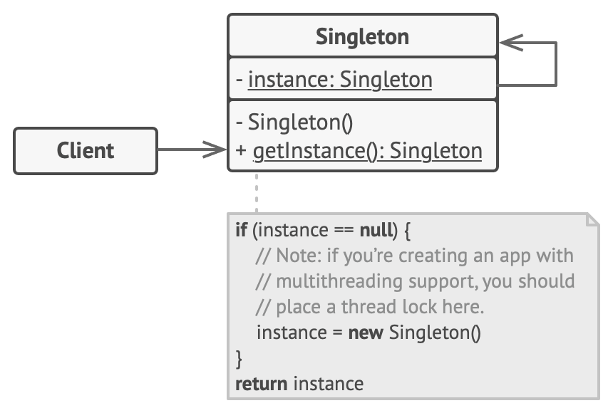
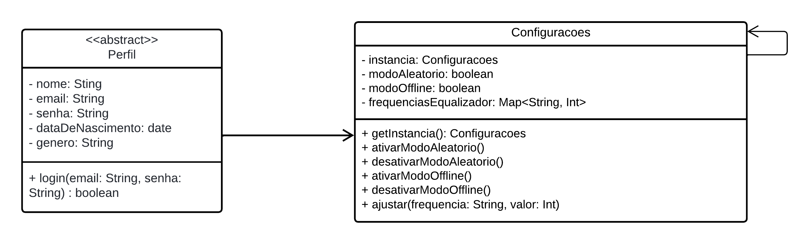

## 3.2.1 GoFs Criacionais
O padrão GoF criacional tem como objetivo simplificar a criação de objetos, fornecendo mecanismos que tornam um sistema independente e flexível em relação a como seus objetos são criados, suas estruturas internas e suas representações. O GoF criacional inclui cinco padrões: Singleton, Factory Method, Abstract Factory, Builder, Prototype e Object Pool.

No contexto do nosso projeto, focaremos nos padrões Factory Method e Singleton.

### 3.2.1.1 Factory Method
#### Introdução
O Factory Method é um padrão criacional que cria um padrão de instanciar uma superclasse, porém, dá a responsabilidade de definir o seu tipo para as subclasses. É um padrão muito utilizado em bibliotecas, como de inteface gráfica onde geralmente existe uma padrão para criar uma superclasse, mas, só no contexto da aplicação (no caso pode ser onde essa interface irá ser executada) que será definido o tipo pela suas subsclasses.
As classes participantes deste padrão serão explicado logo abaixo, juntamente com a imagem da figura 1, que apresenta sua estrutura através de um diagrama.

- Product(Produto abstrato) - Define uma interface para objetos criados pelo método de fábrica
- ConcetreProduct (Produto concreto) - Implementa a interface do produto
- Creator(Criador abstrato) - Possui o método FactoryMethod, que retorna um objeto Product. Pode chamar o método gerador para criar objetos Produto.
- ConcretCreater(Criador concreto) - Substituí o método de geração para criar objetos da classe ConcreProduct

  
  
Figura 1: Estrutura do padrão Factory Method (Fonte: Refactoring Guru, 2014-2024)¹

#### Metodologia

Antes de descrever como foi realizada a modelagem e a implementação dos padrões criacionais utilizados, é importante ressaltar como a equipe foi organizada para a realização deste artefato. Foi criado um subgrupo composto por quatro pessoas: Limírio, Luiz Eduardo, Milena e Vinícius. Todos participaram ativamente através de discussões em grupo e na realização das atividades.

Para o desenvolvimento da modelagem do Factory Method no contexto do nosso projeto, realizamos uma reunião em grupo para discutir onde e como o padrão poderia ser aplicado. A ata dessa reunião pode ser acessada aqui. Durante essa reunião, utilizamos dois sites como referências teóricas para termos um embasamento adequado.

Decidimos que poderíamos utilizar o padrão Factory Method na criação da classe abstrata `Perfil`. Essa superclasse possui duas subclasses, `Usuário` e `Artista`, cujas instâncias mudam conforme o contexto, permitindo funcionalidades diferentes no aplicativo para cada tipo de perfil. A modelagem foi realizada pelos membros Luis Miranda e Vinicius Mendes, conforme visualizado na Figura 2.

  
  
Figura 2: Modelagem do padrão Factory Method (Fonte: Luis Miranda e Vinícius Mendes, 2024)

O desenvolvimento da implementação foi realizado em paralelo com a modelagem, sendo conduzido pelos mesmos membros da equipe. Esta implementação foi feita de forma colaborativa através da plataforma Discord, utilizando como referência o site [Dart Academy](https://dart.academy/creational-design-patterns-for-dart-and-flutter-factory-method/)², que possui exemplos de implementações em diversas linguagens de programação.

Primeiro, foi criado um pseudocódigo para entender de maneira simplificada a lógica e a estrutura do código, que pode ser visualizado no Código 1. Em seguida, o pseudocódigo foi traduzido para a linguagem Dart, escolhida pela equipe para o desenvolvimento do projeto.

### 3.2.1.2. Singleton
#### Introdução
O Singleton é um padrão criacional que garante que uma classe tenha apenas uma instância e fornece um ponto de acesso global a essa instância. Este padrão é amplamente utilizado quando é necessário um único objeto para coordenar ações em todo o sistema, como em gerenciadores de configuração, conexões de banco de dados ou loggers.

O Singleton previne a criação de múltiplas instâncias através de um construtor privado ou protegido e controla o acesso à instância única através de um método estático público. A seguir, serão explicadas as classes participantes deste padrão, juntamente com a imagem da figura 3, que apresenta sua estrutura através de um diagrama.

- Singleton: Define o método estático que controla o acesso à instância única. Implementa um construtor privado para evitar a criação de múltiplas instâncias da classe.
- Cliente: Utiliza a instância única fornecida pelo Singleton para realizar operações necessárias.

  
  
Figura 3: Estrutura do padrão Singleton (Fonte: Refactoring Guru, 2014-2024)¹

No diagrama, podemos ver como o Singleton mantém uma referência estática para a sua única instância e como o método estático garante a criação dessa instância apenas uma vez, fornecendo um ponto de acesso global. O Cliente interage com a instância única do Singleton para executar operações, garantindo que todos os clientes utilizem a mesma instância.

#### Metodologia
A modelagem e implementação deste padrão criacional seguiu o fluxo de desenvolvimento do primeiro com os os integrantes: Limírio, Luiz Eduardo, Milena e Vinícius, participando ativamente através de discussões em grupo e na realização das atividades.

Para o desenvolvimento da modelagem do Singleton no contexto do nosso projeto, realizamos uma reunião em grupo para discutir onde e como o padrão poderia ser aplicado. A ata dessa reunião pode ser acessada aqui. Durante essa reunião, utilizamos dois sites como referências teóricas para termos um embasamento adequado.

Decidimos que poderíamos utilizar o padrão Singleton na criação da classe `Configuracoes``. Esta classe garante que apenas uma instância de configurações seja utilizada em todo o sistema, o que é crucial para garantir a consistência das configurações do aplicativo, como modos aleatório e offline, além das frequências do equalizador.

A modelagem foi realizada pelos membros Limírio Guimarães e Milena Baruc, conforme visualizado na Figura 4.

  
  
Figura 4: Modelagem do padrão Singleton (Fonte: Limírio Guimarães e Milena Baruc, 2024)

No diagrama, podemos ver que a classe `Configuracoes` possui uma referência estática para a sua única instância (`instancia: Configuracoes`) e métodos para acessar e modificar as configurações (`getInstancia()`, `ativarModoAleatorio()`, `desativarModoAleatorio()`, `ativarModoOffline()`, `desativarModoOffline()`, `ajustar(frequencia: String, valor: Int)`). Além disso, há uma associação com a classe abstrata `Perfil`, que pode ser usada para representar diferentes perfis de usuários no sistema.

Este design assegura que todas as partes do sistema utilizem a mesma instância de `Configuracoes`, promovendo a consistência e integridade das configurações em toda a aplicação.

O desenvolvimento da implementação foi realizado em paralelo com a modelagem, sendo conduzido pelos mesmos membros da equipe. Esta implementação foi feita de forma colaborativa através da plataforma Discord, utilizando como referência o site [Dart Academy](https://dart.academy/creational-design-patterns-for-dart-and-flutter-factory-method/)², que possui exemplos de implementações em diversas linguagens de programação.

Primeiro, foi criado um pseudocódigo para entender de maneira simplificada a lógica e a estrutura do código, que pode ser visualizado no Código 2. Em seguida, o pseudocódigo foi traduzido para a linguagem Dart, escolhida pela equipe para o desenvolvimento do projeto.

## Referência Bibliográfica
> ¹ Factory Method, Refactoring.Guru. Disponível em: https://refactoring.guru/design-patterns/factory-method. Acesso em: 15/07/2024.

> ² Creational Design Patterns for Dart and Flutter: Factory Method, Dart Academy. Disponível em: https://dart.academy/creational-design-patterns-for-dart-and-flutter-factory-method/. Acesso em: 20/07/2024

## Bibliografia
> Creational Design Patterns, Refactoring.Guru. Disponível em: https://refactoring.guru/design-patterns/creational-patterns. Acesso em: 15/07/2024.

> Creational Design Patterns, OODesign. Disponível em: https://www.oodesign.com/creational-patterns/. Acesso em: 16/07/204.

## Histórico de Versões

| Versão | Data       | Descrição                                               | Autores                        | Revisores |
| ------ | ---------- | ------------------------------------------------------- | ------------------------------ | --------- |
| 0.1    | 22/07/2024 | Criação do documento e adicionando sobre Factory Method | Luis Miranda e Vinícius Mendes |           |
