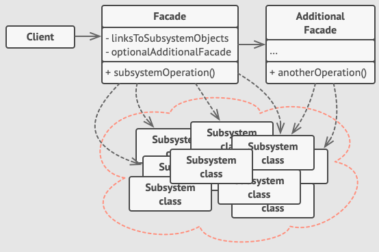
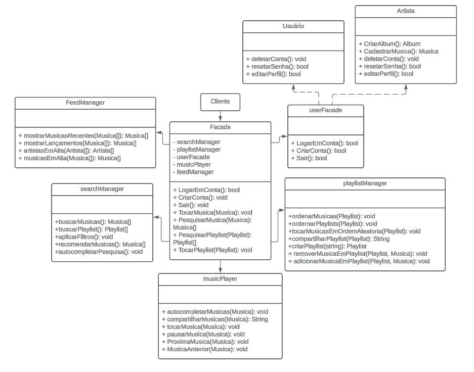

## 3.3.1 GoFs Estrutural

Os padrões GoF estruturais tratam da composição de classes e objetos para formar estruturas maiores e mais complexas. Eles ajudam a garantir que, ao combinar diferentes classes e objetos, o resultado final seja flexível e eficiente, além de ser fácil de manter e entender. Os padrões estruturais focam na maneira como as classes e os objetos são compostos para obter novas funcionalidades e facilitar a gestão do código.

No contexto do nosso projeto, focaremos no padrão Facade.

## 3.3.1.1 Facade

### Introdução
O padrão Facade é um padrão estrutural que oferece uma interface unificada para um conjunto de interfaces em um subsistema. Facade define uma interface de nível mais alto que torna o subsistema mais fácil de usar. O padrão é particularmente útil para sistemas complexos que têm muitas partes interagindo entre si.
As classes deste padrão serão explicadas logo abaixo, juntamente com a imagem da figura 1, que apresenta sua estrutura através de um diagrama.

-   **Facade**: Fornece um acesso conveniente para uma parte particular da funcionalidade do subsistema. Ela sabe onde direcionar o pedido do cliente e como operar todas as partes móveis.
-   **Facade Adicional**: Pode ser criada para prevenir a poluição de uma única fachada com funcionalidades não relevantes que podem torná-lo mais uma estrutura complexa. Fachadas adicionais podem ser usadas tanto por clientes como por outras fachadas.
-   **Subsistema Complexo**: Consiste em dúzias de objetos variados que fazem parte dos detalhes de implementação do subsistema, tais como objetos de inicialização na ordem correta e supri-los com dados no formato correto.

<div style="text-align: center">
  
  <p>Figura 1: Estrutura do padrão Facade (Fonte: Refactoring Guru, 2014-2024)²</p>
</div>

### Metodologia

Primeiramente, foi definido um período para leitura da documentação dos padrões de projeto estruturais e pesquisas individuais, para que os membros contribuíssem com sugestões de GOFs a serem utilizados. Por fim, chegou-se a um consenso pela utilização do padrão Facade.

Para a elaboração da modelagem do Facade, foram realizadas duas reuniões via Discord e foi feito uso da plataforma Lucidchart para diagramação colaborativa.

<div style="text-align: center">
  
  <p>Figura 2: Modelagem do padrão Facade (Fonte: Lucas Alves Vilela, Henrique Hida, Luiz Guilherme e Israel Thalles)</p>
</div>

A figura 2 apresenta a modelagem produzida durante as referidas reuniões.

Em relação a construção do código baseado no diagrama estrutural do Facade desenvolvemos este código em Dart para ilustrar o funcionamento do programa utilizando a linguagem Dart:

```dart
class Musica {
  final String nome;
  final String duracao;
  final String genero;
  final String letra;
  final String album;

  Musica(this.nome, this.duracao, this.genero, this.letra, this.album);
}

class Album {
  final String nome;
  final String descricao;
  final String capa;
  final List<Musica> musicas;

  Album(this.nome, this.descricao, this.capa, this.musicas);
}

class Usuario {
  final String nome;
  final String senha;
  final String email;

  Usuario(this.nome, this.senha, this.email);
}

class Artista extends Usuario {
  final String nomeArtistico;
  final String biografia;

  Artista(String nome, String senha, String email, this.nomeArtistico,this.biografia) : super(nome, senha, email);
}

class Playlist {
  final String nome;
  final List<Musica> musicas;

  Playlist(this.nome, this.musicas);
}

class Facade {
  UserFacade userFacade = UserFacade();
  FeedManager feedManager = FeedManager();
  SearchManager searchManager = SearchManager();
  PlaylistManager playlistManager = PlaylistManager();
  MusicPlayer musicPlayer = MusicPlayer();

  // UserManager
  bool logarEmConta(String email, String senha) { return userFacade.logarEmConta(email, senha); }

  Usuario criarConta(String nome, String senha, String email) { return userFacade.criarConta(nome, senha, email); }

  bool sair() { return userFacade.sair(); }

  // FeedManager
  List<Musica> mostrarMusicasRecentes(List<Musica> musicas) { return feedManager.mostrarMusicasRecentes(musicas); }

  List<Musica> mostrarLancamentos(List<Musica> musicas) { return feedManager.mostrarLancamentos(musicas); }

  List<Artista> artistasEmAlta(List<Artista> artistas) { return feedManager.artistasEmAlta(artistas); }

  List<Musica> musicasEmAlta(List<Musica> musicas) { return feedManager.musicasEmAlta(musicas); }

  // SearchManager
  List<Musica> buscarMusicas(String query) { return searchManager.buscarMusicas(query); }

  List<Album> buscarAlbuns(String query) { return searchManager.buscarAlbuns(query); }

  List<Artista> buscarArtistas(String query) { return searchManager.buscarArtistas(query); }

  void aplicarFiltros(String filtro) => searchManager.aplicarFiltros(filtro);

  List<Musica> recomendarMusicas() { return searchManager.recomendarMusicas(); }

  // PlaylistManager
  void adicionarMusica(Musica musica, Playlist playlist) => playlistManager.adicionarMusica(musica, playlist);

  void removerMusica(Musica musica, Playlist playlist) => playlistManager.removerMusica(musica, playlist);

  void criarPlaylist(Playlist playlist) => playlistManager.criarPlaylist(playlist);

  void deletarPlaylist(Playlist playlist) => playlistManager.deletarPlaylist(playlist);

  void compartilharPlaylist(Playlist playlist) => playlistManager.compartilharPlaylist(playlist);

  void ordenarPlaylists(List<Playlist> playlist) => playlistManager.ordenarPlaylists(playlist);

  void ordenarMusicas(Playlist playlist) => playlistManager.ordenarMusicas(playlist);

  // MusicPlayer
  void play(Musica musica) => musicPlayer.play(musica);

  void pause() => musicPlayer.pause();

  void stop() => musicPlayer.stop();

  void next() => musicPlayer.next();

  void previous() => musicPlayer.previous();

  void compartilhar() => musicPlayer.compartilhar();
}

class UserFacade {
  bool logarEmConta(String email, String senha) { return true; }

  Usuario criarConta(String nome, String senha, String email) { return Usuario(nome, senha, email); }

  bool sair() { return true; }
}

class FeedManager {
  List<Musica> mostrarMusicasRecentes(List<Musica> musicas) { return []; }

  List<Musica> mostrarLancamentos(List<Musica> musicas) { return []; }

  List<Artista> artistasEmAlta(List<Artista> artistas) { return []; }

  List<Musica> musicasEmAlta(List<Musica> musicas) { return []; }
}

class SearchManager {
  List<Musica> buscarMusicas(String query) { return []; }

  List<Album> buscarAlbuns(String query) { return []; }

  List<Artista> buscarArtistas(String query) { return []; }

  void aplicarFiltros(String filtro) => print("Filtro aplicado");

  List<Musica> recomendarMusicas() { return []; }
}

class PlaylistManager {
  void adicionarMusica(Musica musica, Playlist playlist) => playlist.musicas.add(musica);

  void removerMusica(Musica musica, Playlist playlist) => playlist.musicas.remove(musica);

  void criarPlaylist(Playlist playlist) => print("Playlist ${playlist.nome} criada");

  void deletarPlaylist(Playlist playlist) => print("Playlist ${playlist.nome} deletada");

  void compartilharPlaylist(Playlist playlist) => print("Playlist ${playlist.nome} compartilhada");

  void ordenarPlaylists(List<Playlist> playlist) => print("Playlists ordenadas");

  void ordenarMusicas(Playlist playlist) => print("Músicas ordenadas");
}

class MusicPlayer {
  void play(Musica musica) => print("Tocando ${musica.nome}");

  void pause() => print("Pausando a música");

  void stop() => print("Parando a música");

  void next() => print("Próxima música");

  void previous() => print("Música anterior");

  void compartilhar() => print("Compartilhando música");
}
```
Código 1:Ilustração de uma possível implementação simplificada em código do Facade (Fonte: Lucas Alves Vilela, Henrique Hida, Luiz Guilherme, Israel Thalles, 2024)
## Referência Bibliográfica
> ¹ Facade, Refactoring.Guru. Disponível em: https://refactoring.guru/design-patterns/facade. Acesso em: 21/07/2024.

> ² Structural Design Patterns for Dart and Flutter: Façade, Dart Academy. Disponível em: https://dart.academy/structural-design-patterns-for-dart-and-flutter-facade/. Acesso em: 21/07/2024


## Bibliografia
> Structural Design Patterns, Refactoring.Guru. Disponível em: https://refactoring.guru/design-patterns/structural-patterns. Acesso em: 20/07/2024.

## Histórico de Versões

| Versão | Data       | Descrição                                               | Autores                        | Revisores |
| ------ | ---------- | ------------------------------------------------------- | ------------------------------ | --------- |
| 0.1    | 23/07/2024 | Criação do documento e adição do template |  [Lucas Alves Vilela](https://github.com/Lucas-AV), [Henrique Hida](https://github.com/HenriqueHida), [Luiz Guilherme](https://github.com/luizpettengill) e [Israel Thalles](https://github.com/IsraelThalles) | -------- |
| 0.2 | 23/07/2024 | Adição do GOF Estrutural Facade aos Assets & Referências Bibliográficas |  [Lucas Alves Vilela](https://github.com/Lucas-AV), [Henrique Hida](https://github.com/HenriqueHida), [Luiz Guilherme](https://github.com/luizpettengill) e [Israel Thalles](https://github.com/IsraelThalles) | -------- |
| 0.3 | 23/07/2024 | Adição da Introdução e template de GOF Estrutural Facade | [Lucas Alves Vilela](https://github.com/Lucas-AV), [Henrique Hida](https://github.com/HenriqueHida), [Luiz Guilherme](https://github.com/luizpettengill) e [Israel Thalles](https://github.com/IsraelThalles)  | -------- |
| 0.4 | 23/07/2024 | Adição do início da metodologia | [Lucas Alves Vilela](https://github.com/Lucas-AV), [Henrique Hida](https://github.com/HenriqueHida), [Luiz Guilherme](https://github.com/luizpettengill) e [Israel Thalles](https://github.com/IsraelThalles) | -------- |
| 0.5 | 23/07/2024 | Complementação da metodologia com implementação de código em dart |  [Lucas Alves Vilela](https://github.com/Lucas-AV), [Henrique Hida](https://github.com/HenriqueHida), [Luiz Guilherme](https://github.com/luizpettengill) e [Israel Thalles](https://github.com/IsraelThalles)| [João Vítor](https://github.com/Jvsoutomaior) e  [Vinícius Mendes](https://github.com/yabamiah), [Link da revisão](https://github.com/UnBArqDsw2024-1/2024.1_G2_My_Music/pull/64) |
| 0.6 | 24/07/2024 | correção de portugues |  [João Vítor](https://github.com/Jvsoutomaior) | [Limirio Guimarães](https://github.com/LimirioGuimaraes) [link da revisão](https://github.com/UnBArqDsw2024-1/2024.1_G2_My_Music/pull/66#issuecomment-2248941016), [Ana Luíza](https://github.com/analuizargds) [Link da revisão](https://github.com/UnBArqDsw2024-1/2024.1_G2_My_Music/pull/66#pullrequestreview-2197822399), [Rafael Xavier](https://github.com/rafaelxavierr) [Link da revisão](https://github.com/UnBArqDsw2024-1/2024.1_G2_My_Music/pull/66#issuecomment-2249121585) |
