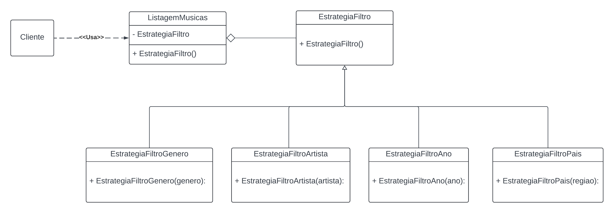

# GoFs Comportamentais Strategy

"O padrão Strategy sugere que você pegue uma classe que faz algo específico em diversas maneiras diferentes e extraia todos esses algoritmos para classes separadas chamadas estratégias.

A classe original, chamada contexto, deve ter um campo para armazenar uma referência para um dessas estratégias. O contexto delega o trabalho para um objeto estratégia ao invés de executá-lo por conta própria.

O contexto não é responsável por selecionar um algoritmo apropriado para o trabalho. Ao invés disso, o cliente passa a estratégia desejada para o contexto. Na verdade, o contexto não sabe muito sobre as estratégias. Ele trabalha com todas elas através de uma interface genérica, que somente expõe um único método para acionar o algoritmo encapsulado dentro da estratégia selecionada.

Desta forma o contexto se torna independente das estratégias concretas, então você pode adicionar novos algoritmos ou modificar os existentes sem modificar o código do contexto ou outras estratégias."

Fonte: [Refactoring Guru](https://refactoring.guru/pt-br/design-patterns/strategy)

## Introdução

Para o aplicativo, foi decidido por usar o padrão "Strategy". O Strategy é um padrão de projeto comportamental que permite que você defina uma família de algoritmos, coloque-os em classes separadas, e faça os objetos deles intercambiáveis.¹ Este padrão mostrou-se o mais adequado para uso e implementação, pois o mesmo permite definir uma família de algoritmos, encapsular cada um deles e torná-los intercambiáveis. Essas características atendem perfeitamente aos critérios de decisão.

## Metodologia

Para a criação do strategy o grupo formou um trio (João Vítor, Carlos Godoy e Carlos Eduardo), que juntou em uma chamada de voz virtual para implementar o Padrão de Projeto comportamental Strategy, nos utilizamos como referência os slides da professora Milene Serrano, suas vídeo aulas gravadas online, a plataforma [refactoring.guru](https://refactoring.guru/design-patterns/strategy), assim como alguns trabalhos antigos da disciplina como [2023.1_G1_ProjetoMercadoLivre](https://unbarqdsw2023-1.github.io/2023.1_G1_ProjetoMercadoLivre/#/PadroesDeProjeto/3.2.1.Strategy)

## GoFs Comportamentais Strategy



<div style="text-align: center">
  <p>Figura 1: Diagrama de classes do padrão Strategy (Fonte: João Vítor, Carlos Godoy e Carlos Eduardo, 2024)</p>
</div>

[Link para visualização Lucichart](https://lucid.app/lucidchart/975f7f68-6a93-4a32-a801-3aae98bb4caa/edit?invitationId=inv_3ad88baf-8c77-475a-b16d-ac75edce0cfb)

### implementação


#### Estratégia Filtro 
```dart
abstract class EstrategiaFiltro {
  List<Musica> EstrategiaFiltro(List<Musica> listaMusicas);
}

```

#### Estratégia concreta Filtro por genero
```dart
class EstrategiaFiltroGenero implements EstrategiaFiltro {
  final String genero;

  EstrategiaFiltroGenero(this.genero);

  @override
  List<Musica> filtrar(List<Musica> listaMusicas) {
    return listaMusicas.where((musica) => musica.genero.toLowerCase() == genero.toLowerCase()).toList();
  }
}
```

#### Estratégia concreta Filtro por artista
```dart
class EstrategiaFiltroArtista implements EstrategiaFiltro {
  final String artista;

  EstrategiaFiltroArtista(this.artista);

  @override
  List<Musica> filtrar(List<Musica> listaMusicas) {
    return listaMusicas.where((musica) => musica.artista.toLowerCase() == artista.toLowerCase()).toList();
  }
}
```

#### Estratégia concreta Filtro por ano de lançamento
```dart
class EstrategiaFiltroAno implements EstrategiaFiltro {
  final int ano;

  EstrategiaFiltroAno(this.ano);

  @override
  List<Musica> filtrar(List<Musica> listaMusicas) {
    return listaMusicas.where((musica) => musica.ano == ano).toList();
  }
}
```

#### Estratégia concreta Filtro por pais
```dart
class EstrategiaFiltroPais implements EstrategiaFiltro {
  final String pais;

  EstrategiaFiltroPais(this.pais);

  @override
  List<Musica> filtrar(List<Musica> listaMusicas) {
    return listaMusicas.where((musica) => musica.pais.toLowerCase() == pais.toLowerCase()).toList();
  }
}
```

## Conclusão 

  O padrão de projeto comportamental Strategy mostra-se útil em situações em que é necessário definir diferentes maneiras de abordar uma mesma solução como por exemplo no nosso caso o filtro de muúsica. Outros contextos em que o padrão Strategy pode ser aplicado são: pagamento, ordenação, entre outros. A implementação do padrão Strategy foi realizada com sucesso, e o grupo conseguiu entender a importância de se utilizar padrões de projeto para facilitar a manutenção e a escalabilidade do código.

## Referências Bibliográficas
> ¹ Refactoring Guru. Strategy Disponível em: <https://refactoring.guru/design-patterns/strategy>. Acesso em: 24 julho 2024.

## Bibliográfia

> Refactoring Guru. Strategy Disponível em: <https://refactoring.guru/pt-br/design-patterns/strategy>. Acesso em: 24 julho 2024.

## Histórico de Versão

| Versão  | Data       | Descrição                  | Autor                    | Revisor   |
|---------|------------|----------------------------|-------------|-----------|
| 1.0 | 23/06/2024 | Primeira versão do GoF Comportamental Strategy | João Vítor, Carlos Eduardo e Carlos Godoy | |
| Versão  | Data       | Descrição                  | Autor                    | Revisor   |
|---------|------------|----------------------------|-------------|-----------|
| 1.1 | 24/06/2024 | explicação do Strategy, correção no modelo, correção de portugues | João Vítor | |
