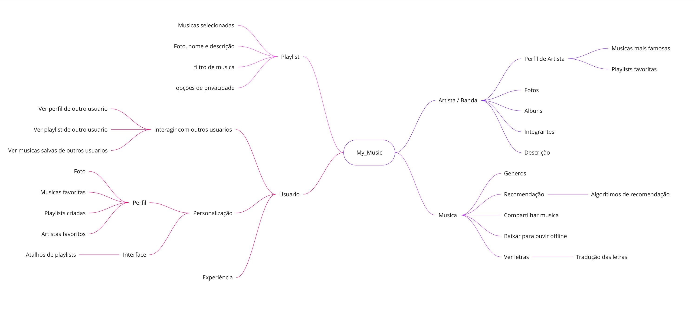

# Mapa Mental

## Introdução

A seguir, encontra-se na figura 1 o mapa mental produzido pelo discente João Vítor Motta, a fim de ajudar a organizar informações, capturar ideias, explorar relações, comunicar conceitos e facilitar o processo de desenvolvimento do aplicativo My Music.

## Mapa

 Figura 1: Mapa Mental do My Music. (Fonte: João Vítor Motta, 2024). 

## Histórico de Versão

| Versão | Data       | Descrição                          | Autor(es)     |  Revisor(es)  |
| ------ | ---------- | ---------------------------------- | ------------- | ------------- |
| `1.0`  | 07/04/2024 | Criação do mapa e do artefato          | João Vítor e Rafael Xavier   |  Rafael Xavier