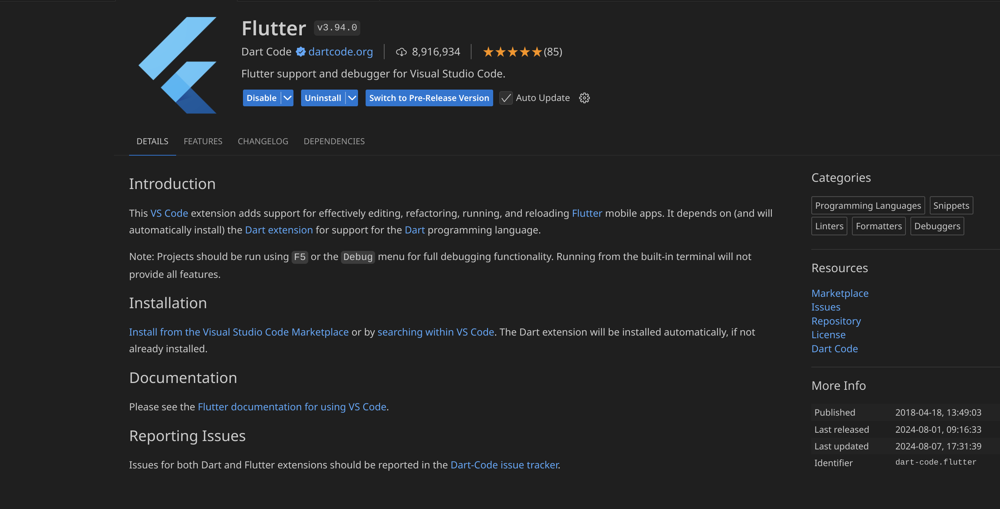
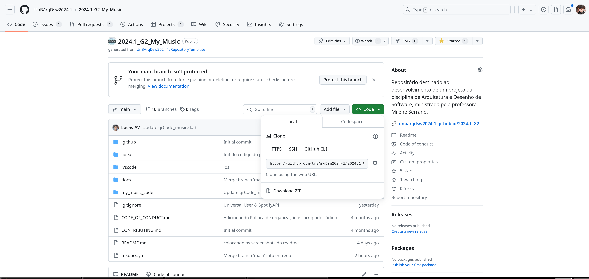
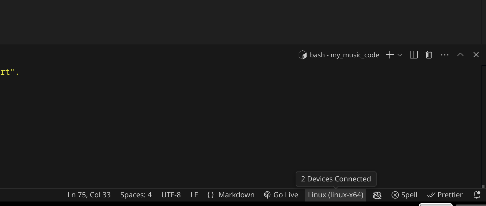
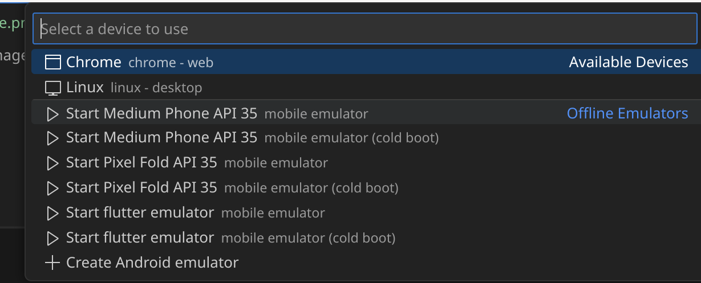

<div align="center">


</div>

# 👨‍💻 Guia de Instalação

## 🚀 Linux (Debian/Ubuntu) 

### 1) Baixar o Android Studio 

[Guia de instalação](https://developer.android.com/studio/install?hl=pt-br) 

[Android Studio download](https://developer.android.com/studio?hl=pt-br) 

 

“ 

Para instalar o Android Studio no Linux, siga estas etapas: 

    Descompacte o arquivo .tar.gz transferido por download em um local adequado para seus aplicativos, como /usr/local/ para seu perfil de usuário ou /opt/ para usuários compartilhados.  

Em uma versão de 64 bits do Linux, primeiro instale as bibliotecas necessárias para máquinas de 64 bits.  

    Para iniciar o Android Studio, abra um terminal, navegue até o diretório android-studio/bin/ e execute studio.sh. 

    Selecione se você quer ou não importar as configurações anteriores do Android Studio e clique em OK. 

    Conclua as etapas do assistente de configuração do Android Studio, que inclui o download dos componentes do SDK do Android necessários para o desenvolvimento. 

 

Bibliotecas necessárias para máquinas de 64 bits  

Se você estiver executando uma versão do Ubuntu de 64 bits, será necessário instalar algumas bibliotecas de 32 bits com o seguinte comando: 

``` 

sudo apt-get install libc6:i386 libncurses5:i386 libstdc++6:i386 lib32z1 libbz2-1.0:i386 

``` 
 

” 

### 2) Baixar o Flutter 

[Guia de instalação](https://docs.flutter.dev/get-started/install/linux/android) 

 

### 3) Baixar o VS Code 

[Guia de instalação](https://code.visualstudio.com/docs/setup/linux) 

[Download](https://code.visualstudio.com/download) 

 

### 4) Baixar a extensão do Flutter no vs code



### 5) Clonar o repositorio



### 6) Abrir o repositorio no vs code

Vá para o diretório do projeto
```
cd my_music_code
```

Selecione um emulador de celular






 🎼 Rode o projeto e curta uma música 💃 
```
Flutter run
```

## 🚀 Windows

### 1) Baixar o Android Studio 

[Guia de instalação](https://developer.android.com/studio/install?hl=pt-br) 

[Android Studio download](https://developer.android.com/studio?hl=pt-br) 

“ 

Para instalar o Android Studio no Windows, siga estas etapas: 

    Execute o arquivo .exe baixado no site do android studio.  

### 2) Baixar o Flutter 

[Guia de instalação]([https://docs.flutter.dev/get-started/install/linux/android](https://docs.flutter.dev/get-started/install/windows/mobile)

### 3) Baixar o VS Code 

[Guia de instalação](https://code.visualstudio.com/docs/setup/linux) 

[Download](https://code.visualstudio.com/download) 

### 4) Baixar a extensão do Flutter no vs code


### 6) Clonar o repositorio


Seleciona um emulador de celular


 🎼 Rode o projeto e curta uma música 💃 
```
Flutter run
```
